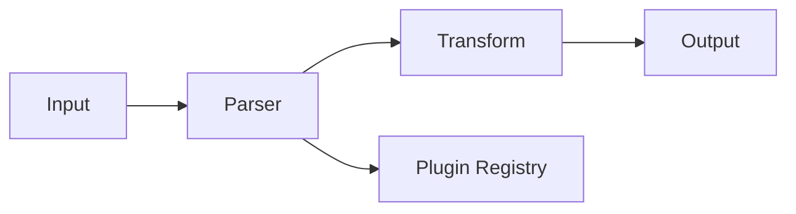

# README Craft Reference

Reference for generating high-quality README files. Covers anatomy, badges, demos, SEO, visual identity, and project-type templates.

---

## 1. README Anatomy

Sections listed in canonical order. Not every project needs every section -- skip what does not apply.

### Section Order and When Each Is Needed

| # | Section | When needed |
|---|---------|-------------|
| 1 | Logo / banner | Projects with visual identity or brand |
| 2 | Project name + tagline | Always |
| 3 | Badge row | Always (at minimum: CI + license) |
| 4 | Demo GIF / screenshot | Projects with UI or CLI output |
| 5 | Table of contents | When README has more than 3 sections |
| 6 | Key features | Always |
| 7 | Quick start | Always -- 5 commands or fewer |
| 8 | Installation | When multiple install methods exist |
| 9 | Usage examples | Always |
| 10 | Configuration | When the tool has config options |
| 11 | API reference | Libraries and APIs (or link to docs site) |
| 12 | Architecture overview | Complex projects, monorepos, plugin systems |
| 13 | Roadmap | Active projects seeking contributors |
| 14 | Contributing | Open source projects (or link to CONTRIBUTING.md) |
| 15 | License | Always |

### Section Details

#### Logo / Banner

Use the `<picture>` element for dark mode support. Store assets in `assets/` or `.github/`.

```html
<p align="center">
  <picture>
    <source media="(prefers-color-scheme: dark)" srcset="assets/logo-dark.svg">
    <source media="(prefers-color-scheme: light)" srcset="assets/logo-light.svg">
    
  </picture>
</p>
```

#### Project Name + Tagline

```markdown
# project-name

One sentence that explains what this does and why someone should care.
```

The tagline should answer: "What is this?" in under 15 words. Do not repeat the project name.

#### Badge Row

Place immediately after the tagline. See the Badges Deep Dive section below for URL patterns.

```markdown
[](...)
[](...)
[](...)
[](...)
```

#### Demo GIF / Screenshot

Place after badges. Keep GIFs under 5MB. Show the core workflow, not every feature.

```markdown
<p align="center">
  
</p>
```

#### Table of Contents

Add when the README exceeds 3 major sections. Use a simple list.

```markdown
## Table of Contents

- [Features](#features)
- [Quick Start](#quick-start)
- [Installation](#installation)
- [Usage](#usage)
- [Configuration](#configuration)
- [Contributing](#contributing)
- [License](#license)
```

#### Key Features

Bullet list. Each bullet starts with a bold keyword, followed by a dash and short explanation.

```markdown
## Features

- **Fast** -- 10x faster than alternatives thanks to parallel processing
- **Type-safe** -- full TypeScript support with zero `any` types
- **Zero config** -- works out of the box with sensible defaults
- **Extensible** -- plugin system for custom transformations
```

Keep to 4-8 bullets. If you need more, the project description is too broad.

#### Quick Start

Five commands maximum. Copy-paste ready. No explanation needed between commands -- if it needs explanation, it is not quick enough.

```markdown
## Quick Start

```bash
npm install project-name
```

```js
import { thing } from 'project-name';

const result = thing('hello');
console.log(result);
```
```

#### Installation

Use HTML `<details>` for multiple methods when there are 3+ options.

```markdown
## Installation

### npm

```bash
npm install project-name
```

<details>
<summary>yarn</summary>

```bash
yarn add project-name
```

</details>

<details>
<summary>pnpm</summary>

```bash
pnpm add project-name
```

</details>

<details>
<summary>Homebrew</summary>

```bash
brew install project-name
```

</details>
```

#### Usage Examples

Progress from simple to complex. Three examples is the sweet spot.

```markdown
## Usage

### Basic

```js
import { parse } from 'project-name';
const data = parse('input.csv');
```

### With Options

```js
const data = parse('input.csv', {
  delimiter: '\t',
  header: true,
});
```

### Advanced: Streaming

```js
const stream = parseStream('large.csv');
stream.on('data', (row) => process(row));
stream.on('end', () => console.log('Done'));
```
```

#### Configuration

Use a table. Include type, default, and description.

```markdown
## Configuration

| Option | Type | Default | Description |
|--------|------|---------|-------------|
| `delimiter` | `string` | `","` | Column separator character |
| `header` | `boolean` | `true` | Treat first row as header |
| `encoding` | `string` | `"utf-8"` | File encoding |
| `strict` | `boolean` | `false` | Throw on malformed rows |
```

#### API Reference

For small APIs, document inline. For large APIs, link to a docs site.

```markdown
## API

### `parse(file, options?)`

Parse a CSV file and return an array of objects.

**Parameters:**

| Name | Type | Required | Description |
|------|------|----------|-------------|
| `file` | `string` | Yes | Path to the CSV file |
| `options` | `ParseOptions` | No | Configuration options |

**Returns:** `Record<string, string>[]`

**Example:**

```js
const rows = parse('data.csv', { header: true });
```
```

For large APIs:

```markdown
## API

Full API documentation is available at [project-name.dev/api](https://project-name.dev/api).
```

#### Architecture Overview

Use when the project has non-obvious structure. A simple ASCII diagram or Mermaid block works.

```markdown
## Architecture

```
src/
  parser/       # CSV parsing engine
  transform/    # Data transformation pipeline
  output/       # Format writers (JSON, SQL, etc.)
  plugins/      # Plugin loader and registry
```
```

Or with Mermaid (renders on GitHub):

````markdown

````

#### Roadmap

Use a checklist. Be honest about what is done and what is not.

```markdown
## Roadmap

- [x] CSV parsing
- [x] TSV support
- [ ] Excel (.xlsx) support
- [ ] Streaming API
- [ ] Browser support

See the [open issues](https://github.com/owner/repo/issues) for a full list of proposed features.
```

#### Contributing

Short version for the README. Link to CONTRIBUTING.md for details.

```markdown
## Contributing

Contributions are welcome. See [CONTRIBUTING.md](CONTRIBUTING.md) for guidelines.

```bash
git clone https://github.com/owner/repo.git
cd repo
npm install
npm test
```
```

#### License

One line. Link to the LICENSE file.

```markdown
## License

[MIT](LICENSE)
```

### Full README Template Skeleton

```markdown
<p align="center">
  <picture>
    <source media="(prefers-color-scheme: dark)" srcset="assets/logo-dark.svg">
    <source media="(prefers-color-scheme: light)" srcset="assets/logo-light.svg">
    
  </picture>
</p>

<h1 align="center">project-name</h1>
<p align="center">One sentence that explains what this does and why someone should care.</p>

<p align="center">
  <a href="..."></a>
  <a href="..."></a>
  <a href="..."></a>
  <a href="..."></a>
</p>

<p align="center">
  
</p>

---

## Features

- **Feature 1** -- description
- **Feature 2** -- description
- **Feature 3** -- description

## Quick Start

\```bash
npm install project-name
\```

\```js
import { thing } from 'project-name';
thing();
\```

## Installation

\```bash
npm install project-name
\```

<details>
<summary>Other package managers</summary>

\```bash
yarn add project-name    # yarn
pnpm add project-name   # pnpm
\```

</details>

## Usage

### Basic

\```js
// minimal example
\```

### With Options

\```js
// example with common options
\```

### Advanced

\```js
// complex real-world example
\```

## Configuration

| Option | Type | Default | Description |
|--------|------|---------|-------------|
| `option` | `string` | `"default"` | What it does |

## API

### `functionName(arg1, arg2?)`

Description.

**Parameters:**

| Name | Type | Required | Description |
|------|------|----------|-------------|
| `arg1` | `string` | Yes | Description |

**Returns:** `ReturnType`

## Architecture

\```
src/
  module/    # description
\```

## Roadmap

- [x] Completed feature
- [ ] Planned feature

## Contributing

Contributions welcome. See [CONTRIBUTING.md](CONTRIBUTING.md).

## License

[MIT](LICENSE)
```

---

## 2. Badges Deep Dive

Use `flat-square` style everywhere for consistency. All URLs use shields.io.

### Badge Ordering Convention

Place badges in this order: **CI -> Coverage -> Code Quality -> Version -> License -> Downloads**

### CI Status

```markdown
<!-- GitHub Actions -->


<!-- GitHub Actions - specific branch -->


<!-- Travis CI -->


<!-- CircleCI -->

```

### Coverage

```markdown
<!-- Codecov -->


<!-- Coveralls -->


<!-- Code Climate -->

```

### Code Quality

```markdown
<!-- Code Climate maintainability -->


<!-- Snyk vulnerabilities -->

```

### Package Version

```markdown
<!-- npm -->


<!-- npm (scoped) -->


<!-- PyPI -->


<!-- crates.io -->


<!-- Go module -->


<!-- Maven Central -->


<!-- NuGet -->


<!-- Gem -->

```

### Downloads

```markdown
<!-- npm downloads (monthly) -->


<!-- npm downloads (total) -->


<!-- PyPI downloads (monthly) -->


<!-- crates.io downloads -->

```

### License

```markdown
<!-- From GitHub -->


<!-- Static (when not detectable) -->

```

### GitHub Stars / Forks

```markdown


```

### Custom / Static Badges

```markdown
<!-- Static badge -->


<!-- With logo -->


<!-- Dynamic JSON endpoint -->

```

Colors: `brightgreen`, `green`, `yellow`, `orange`, `red`, `blue`, `lightgrey`, or hex without `#` (e.g., `ff69b4`).

### Complete Badge Row Example

```markdown
[](https://github.com/owner/repo/actions)
[](https://codecov.io/gh/owner/repo)
[](https://www.npmjs.com/package/package)
[](LICENSE)
[](https://www.npmjs.com/package/package)
```

---

## 3. Multi-Language READMEs

### File Naming Convention

```
README.md              # English (default)
README.zh-CN.md        # Chinese (Simplified)
README.zh-TW.md        # Chinese (Traditional)
README.ja.md           # Japanese
README.ko.md           # Korean
README.es.md           # Spanish
README.fr.md           # French
README.de.md           # German
README.pt-BR.md        # Portuguese (Brazil)
README.ru.md           # Russian
README.ar.md           # Arabic
```

Use IETF language tags. Lowercase language, uppercase region.

### Language Switcher Badge Pattern

Place at the top of every README variant:

```markdown
<p align="center">
  <a href="README.md">English</a> |
  <a href="README.zh-CN.md">简体中文</a> |
  <a href="README.ja.md">日本語</a> |
  <a href="README.ko.md">한국어</a>
</p>
```

Or with badges:

```markdown
[](README.md)
[](README.zh-CN.md)
[](README.ja.md)
```

### Guidelines

- Keep all language versions in the repo root (not in subdirectories).
- The default `README.md` should always be English.
- Translate content, not code examples. Code stays in the original language.
- Keep badge URLs identical across translations -- only translate alt text.

---

## 4. Demo Patterns

### VHS by Charm (CLI Tools)

VHS generates GIFs from `.tape` script files. Best for CLI tools where you want reproducible, perfectly-timed demos.

```tape
# demo.tape
Output demo.gif

Set FontSize 14
Set Width 800
Set Height 400
Set Theme "Catppuccin Mocha"

Type "npm install project-name" Sleep 500ms Enter
Sleep 2s
Type "project-name init" Sleep 500ms Enter
Sleep 3s
Type "project-name run" Sleep 500ms Enter
Sleep 5s
```

Generate with:

```bash
vhs demo.tape
```

Advantages: deterministic output, no screen recording needed, version-controllable `.tape` files, consistent terminal appearance.

### asciinema (Terminal Recordings)

Record real terminal sessions. Good for showing interactive workflows.

```bash
# Record
asciinema rec demo.cast

# Upload (hosted playback)
asciinema upload demo.cast
```

Embed with the player:

```html
<a href="https://asciinema.org/a/RECORDING_ID">
  
</a>
```

Or use `agg` to convert `.cast` to GIF:

```bash
agg demo.cast demo.gif --theme monokai
```

### Screenshots for GUI Apps

Provide light and dark variants:

```html
<p align="center">
  <picture>
    <source media="(prefers-color-scheme: dark)" srcset="assets/screenshot-dark.png">
    <source media="(prefers-color-scheme: light)" srcset="assets/screenshot-light.png">
    
  </picture>
</p>
```

Guidelines:
- Use real data, not "lorem ipsum."
- Crop to the relevant area -- do not show the full desktop.
- Optimize PNGs with `pngquant` or `optipng`. Keep under 500KB.
- Use consistent dimensions across screenshots.

### "Open In" Buttons for Live Demos

#### StackBlitz

```markdown
[](https://stackblitz.com/github/OWNER/REPO)
```

#### CodeSandbox

```markdown
[](https://codesandbox.io/s/github/OWNER/REPO)
```

### "Deploy To" Buttons

#### Vercel

```markdown
[](https://vercel.com/new/clone?repository-url=https://github.com/OWNER/REPO)
```

#### Heroku

```markdown
[](https://heroku.com/deploy?template=https://github.com/OWNER/REPO)
```

Requires an `app.json` in the repo root.

#### Railway

```markdown
[](https://railway.com/template/TEMPLATE_CODE)
```

#### Render

```markdown
[](https://render.com/deploy?repo=https://github.com/OWNER/REPO)
```

Requires a `render.yaml` in the repo root.

### "Open In" Development Environment Buttons

#### Gitpod

```markdown
[](https://gitpod.io/#https://github.com/OWNER/REPO)
```

#### GitHub Codespaces

```markdown
[](https://codespaces.new/OWNER/REPO)
```

Requires a `.devcontainer/devcontainer.json` in the repo.

---

## 5. Repo SEO and Discoverability

### GitHub Topics Strategy

GitHub allows up to 20 topics. Use at least 6. Pick from these categories:

1. **Language/runtime:** `javascript`, `typescript`, `python`, `rust`, `go`
2. **Framework:** `react`, `nextjs`, `fastapi`, `express`
3. **Domain:** `cli`, `api`, `database`, `devtools`, `testing`
4. **Use case:** `parser`, `formatter`, `linter`, `bundler`
5. **Ecosystem:** `npm`, `pip`, `cargo`
6. **Descriptive:** `open-source`, `developer-tools`, `automation`

Rules:
- Use the most popular variant of a topic (check GitHub topic pages for follower counts).
- Put the most important topics first -- GitHub may truncate the display.
- Include the project type (`cli-tool`, `library`, `framework`).
- Add `hacktoberfest` in October if accepting contributions.

### Description Optimization

GitHub repo descriptions are limited to roughly 350 chars, but search previews truncate around 120. Rules:

- Put the primary keyword first.
- State what the project does, not what it is.
- Skip articles ("a", "the") and filler ("simple", "lightweight" -- show, don't tell).
- Include the main differentiator.

Good: `Fast CSV parser for Node.js with streaming support and zero dependencies`
Bad: `A simple and lightweight library for parsing CSV files`

### Social Preview Image

Dimensions: **1280 x 640 px** (2:1 ratio). This appears on Twitter/X, Slack, Discord link previews.

Set at: Settings > Social preview > Edit > Upload an image.

Tools to generate:
- **Figma** -- full control, export as PNG
- **GitHub Social Preview Generator** (socialify.git.ci) -- generates from repo metadata
- **Carbon** (carbon.now.sh) -- for code-snippet previews
- **Canva** -- quick option with templates

Include: project name, logo, tagline, and optionally a code snippet or screenshot. Use high contrast. Test at small sizes.

### Package Registry Keywords

#### npm (package.json)

```json
{
  "keywords": [
    "csv",
    "parser",
    "streaming",
    "data",
    "transform"
  ]
}
```

Use 5-10 keywords. Check npm search to see what surfaces results.

#### PyPI (pyproject.toml)

```toml
[project]
keywords = ["csv", "parser", "data", "streaming"]
classifiers = [
    "Development Status :: 4 - Beta",
    "Intended Audience :: Developers",
    "License :: OSI Approved :: MIT License",
    "Programming Language :: Python :: 3",
    "Programming Language :: Python :: 3.10",
    "Programming Language :: Python :: 3.11",
    "Programming Language :: Python :: 3.12",
    "Topic :: Software Development :: Libraries",
]
```

Use [PyPI classifiers](https://pypi.org/classifiers/) -- they drive filtering on the PyPI website.

#### crates.io (Cargo.toml)

```toml
[package]
keywords = ["csv", "parser", "data", "streaming"]  # max 5
categories = ["command-line-utilities", "parser-implementations"]  # from crates.io list
```

Keywords: max 5, each max 20 chars. Categories: pick from the [crates.io category list](https://crates.io/categories).

---

## 6. Visual Identity in Repos

### Logo Placement

Store logos in one of two locations:

```
assets/
  logo.svg
  logo-dark.svg
  logo-light.svg
  banner.png
```

Or:

```
.github/
  logo.svg
  logo-dark.svg
  logo-light.svg
```

Use `assets/` for projects where the logo is part of the project identity. Use `.github/` when the logo is GitHub-specific and should not ship with the package.

Add `assets/` or `.github/` to `.npmignore` / the `files` field in `package.json` to exclude from published packages.

### Format Preference

**SVG is preferred.** It scales to any size, has small file size, and supports CSS-based dark mode. Use PNG only as a fallback for contexts that do not render SVG (some npm README renderers, email, etc.).

When providing PNG, include `@2x` versions for Retina displays:

```
assets/
  logo.png       # 200x200
  logo@2x.png    # 400x400
```

### Dark Mode Support Patterns

#### Pattern 1: `<picture>` element (recommended)

```html
<picture>
  <source media="(prefers-color-scheme: dark)" srcset="assets/logo-dark.svg">
  <source media="(prefers-color-scheme: light)" srcset="assets/logo-light.svg">
  
</picture>
```

This is the most reliable approach. GitHub renders `<picture>` correctly.

#### Pattern 2: Single SVG with CSS media query

Embed the media query inside the SVG file:

```svg
<svg xmlns="http://www.w3.org/2000/svg" viewBox="0 0 200 200">
  <style>
    @media (prefers-color-scheme: dark) {
      .logo-text { fill: #ffffff; }
      .logo-bg { fill: #1a1a2e; }
    }
    @media (prefers-color-scheme: light) {
      .logo-text { fill: #1a1a2e; }
      .logo-bg { fill: #ffffff; }
    }
  </style>
  <rect class="logo-bg" width="200" height="200"/>
  <text class="logo-text" x="100" y="110" text-anchor="middle">Logo</text>
</svg>
```

This works on GitHub but not in all renderers (npm, PyPI). Use `<picture>` for cross-platform reliability.

#### Pattern 3: GitHub theme-specific URLs

GitHub supports `#gh-dark-mode-only` and `#gh-light-mode-only` fragments:

```markdown


```

This is GitHub-specific. Does not work on npm, GitLab, or other platforms.

---

## 7. README by Project Type

### Library

Focus: install, usage, API.

```markdown
# lib-name

What it does in one sentence.

[badges: CI | coverage | npm version | license]

## Install

```bash
npm install lib-name
```

## Usage

```js
import { fn } from 'lib-name';
const result = fn(input);
```

## API

### `fn(input, options?)`

[parameter table]
[return type]

### `fn2(input)`

[parameter table]
[return type]

## Configuration

[options table if applicable]

## Contributing

[link to CONTRIBUTING.md]

## License

[MIT](LICENSE)
```

Key points:
- API section is the centerpiece. Document every public export.
- Usage examples should show real return values.
- Include TypeScript types if applicable.
- Show both ESM and CJS imports if the library supports both.

### CLI Tool

Focus: install, commands, examples.

```markdown
# cli-name

What it does in one sentence.

[badges: CI | version | license]

[demo GIF -- use VHS or asciinema]

## Install

```bash
npm install -g cli-name
# or
brew install cli-name
# or
curl -fsSL https://cli-name.dev/install.sh | sh
```

## Usage

```bash
cli-name <command> [options]
```

## Commands

### `cli-name init`

Initialize a new project.

```bash
cli-name init my-project
cli-name init my-project --template react
```

### `cli-name build`

Build the project.

```bash
cli-name build
cli-name build --watch
cli-name build --target production
```

## Options

| Flag | Short | Default | Description |
|------|-------|---------|-------------|
| `--config` | `-c` | `cli-name.config.js` | Config file path |
| `--verbose` | `-v` | `false` | Verbose output |
| `--quiet` | `-q` | `false` | Suppress output |

## Configuration

[config file format and options]

## License

[MIT](LICENSE)
```

Key points:
- Demo GIF is critical. Show the tool in action.
- Document every command and every flag.
- Show the install command for each platform (npm, brew, curl).
- Include shell completion instructions if available.

### SaaS / Web App

Focus: features, screenshots, getting started.

```markdown
# app-name

What it does in one sentence.

[badges: CI | license | website]

[hero screenshot]

## Features

- **Feature 1** -- description with screenshot
- **Feature 2** -- description with screenshot
- **Feature 3** -- description with screenshot

## Getting Started

1. Sign up at [app-name.com](https://app-name.com)
2. Create a new project
3. Connect your repository

Or self-host:

```bash
docker compose up -d
```

## Self-Hosting

### Requirements

- Docker 20+
- PostgreSQL 14+
- 2GB RAM minimum

### Quick Start

```bash
git clone https://github.com/owner/app-name.git
cd app-name
cp .env.example .env
docker compose up -d
```

### Configuration

[environment variables table]

## Contributing

[link to CONTRIBUTING.md]

## License

[MIT](LICENSE)
```

Key points:
- Screenshots are the centerpiece. Show the actual UI.
- Separate "hosted" and "self-hosted" paths clearly.
- List system requirements for self-hosting.
- Use environment variable tables for configuration.

### API Service

Focus: endpoints, authentication, examples.

```markdown
# api-name

What it does in one sentence.

[badges: CI | version | license | uptime]

## Authentication

All requests require an API key in the `Authorization` header:

```bash
curl -H "Authorization: Bearer YOUR_API_KEY" https://api.example.com/v1/resource
```

Get your API key at [app-name.com/settings](https://app-name.com/settings).

## Endpoints

### `GET /v1/resources`

List all resources.

```bash
curl https://api.example.com/v1/resources \
  -H "Authorization: Bearer $API_KEY"
```

Response:

```json
{
  "data": [
    { "id": "abc123", "name": "Example" }
  ],
  "meta": { "total": 1, "page": 1 }
}
```

### `POST /v1/resources`

Create a resource.

```bash
curl -X POST https://api.example.com/v1/resources \
  -H "Authorization: Bearer $API_KEY" \
  -H "Content-Type: application/json" \
  -d '{"name": "New Resource"}'
```

## SDKs

```bash
npm install api-name          # Node.js
pip install api-name          # Python
cargo add api-name            # Rust
```

```js
import { Client } from 'api-name';
const client = new Client('YOUR_API_KEY');
const resources = await client.resources.list();
```

## Rate Limits

| Plan | Requests/min | Requests/day |
|------|-------------|-------------|
| Free | 60 | 1,000 |
| Pro | 600 | 50,000 |
| Enterprise | Unlimited | Unlimited |

## Errors

| Code | Description |
|------|-------------|
| `400` | Bad request -- check your parameters |
| `401` | Unauthorized -- invalid API key |
| `404` | Not found |
| `429` | Rate limited -- slow down |
| `500` | Server error -- try again later |

## License

[MIT](LICENSE)
```

Key points:
- Show `curl` examples for every endpoint. Developers test with curl first.
- Include response bodies so readers know what to expect.
- Document authentication upfront, before any endpoints.
- List rate limits and error codes. These are always asked about.
- Provide SDK examples in multiple languages if available.
