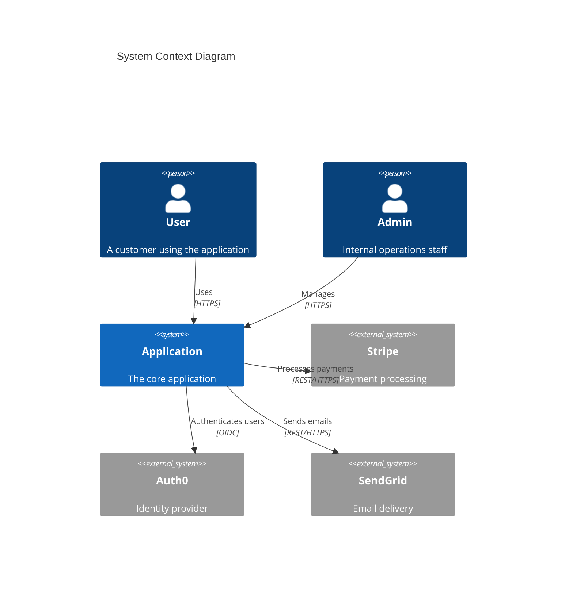
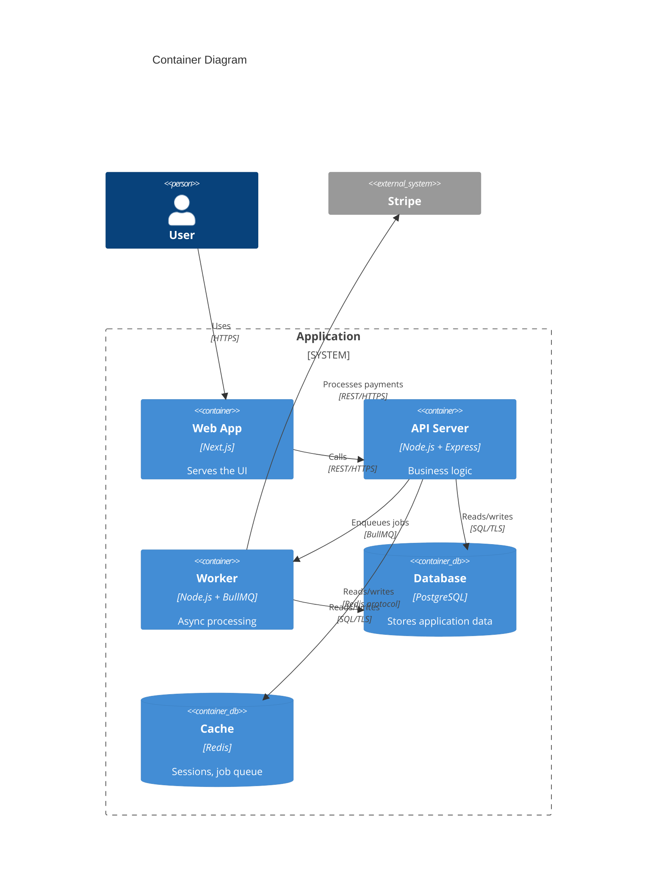
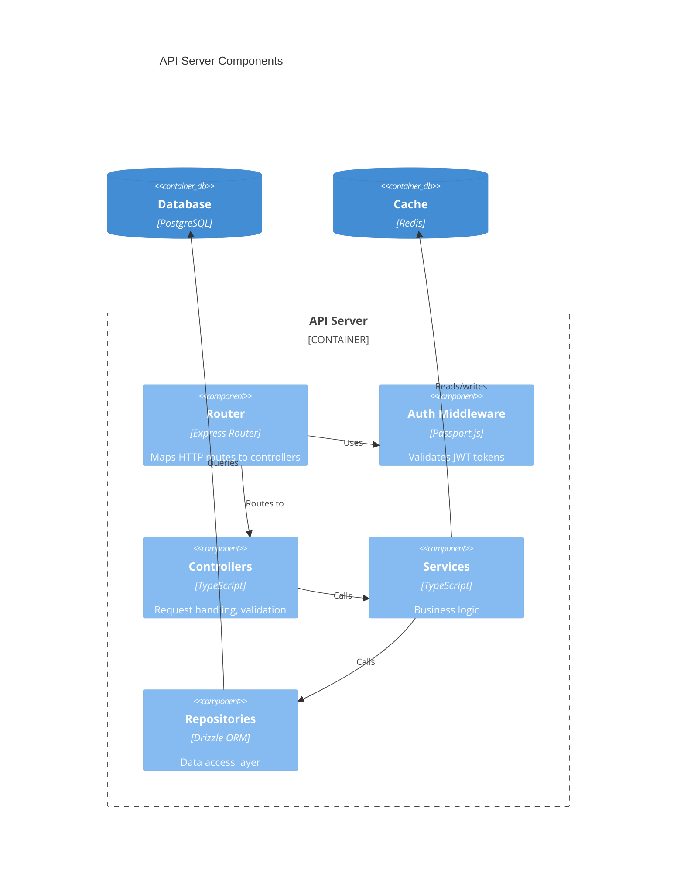
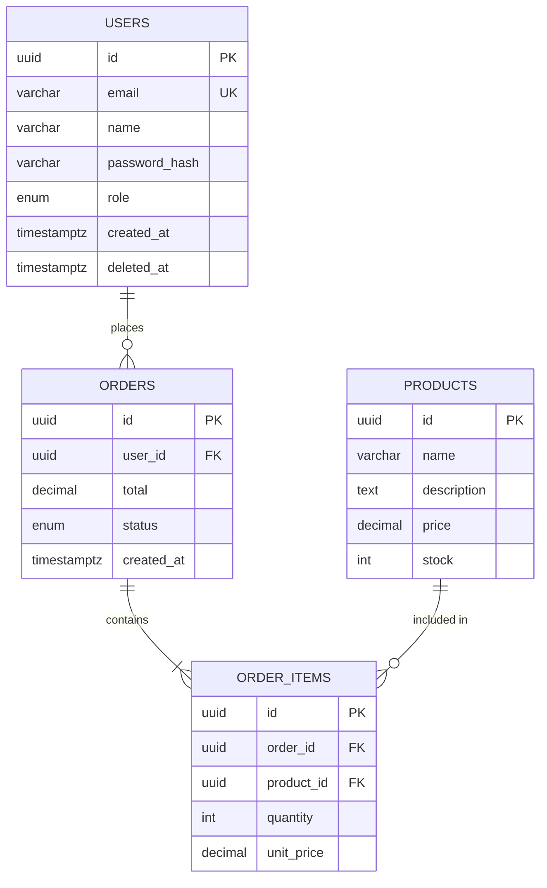
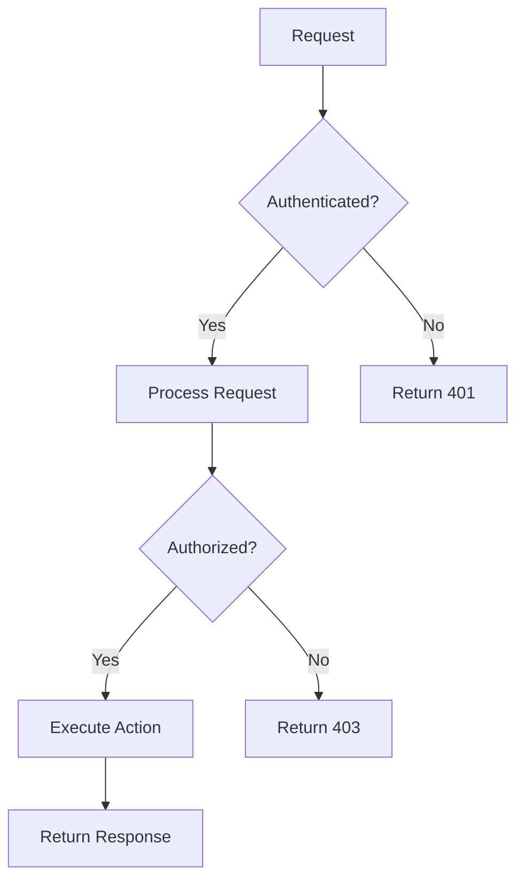
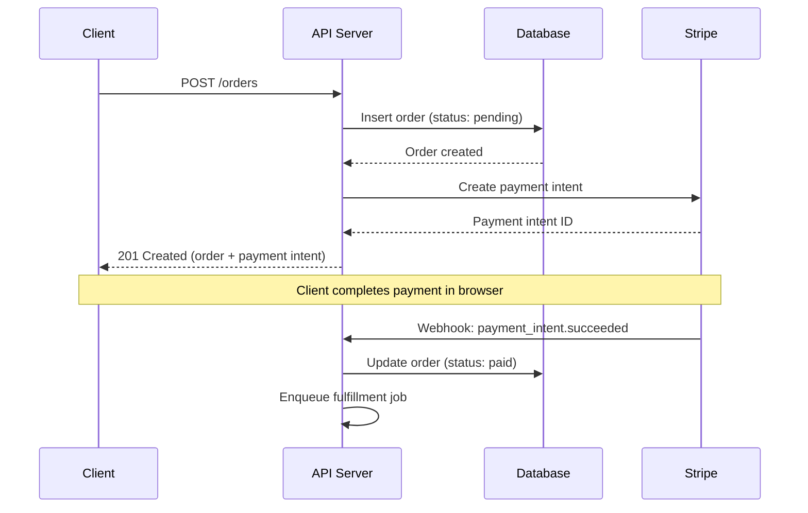
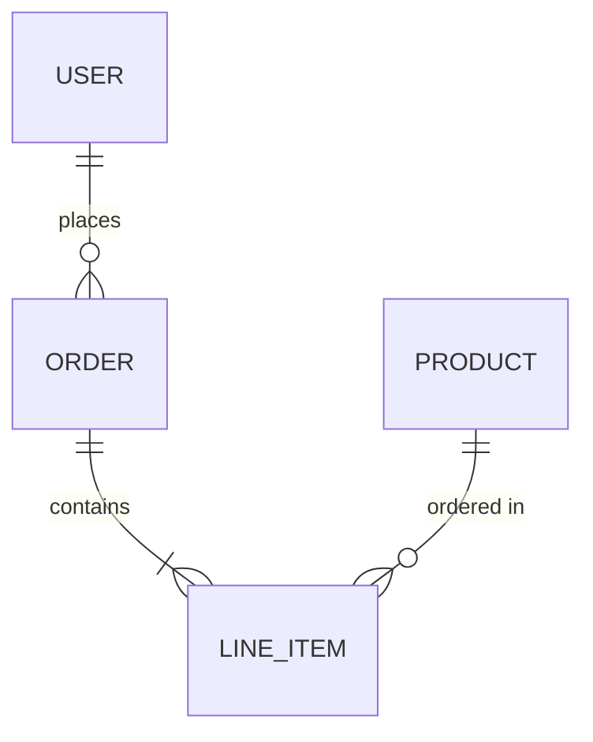
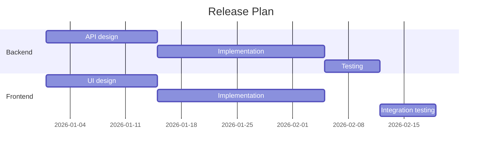
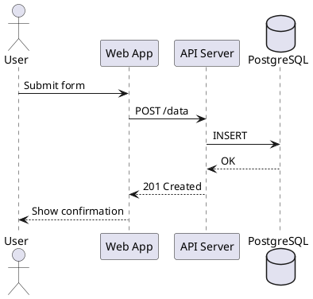

# Technical Documentation Reference

Reference for architecture decisions, design proposals, API documentation, runbooks, and diagrams-as-code. This covers Tier 4 documentation — load this reference when the project needs architecture records, operational documentation, or technical design artifacts.

## When to use what

| Document type | When to create it | Who reads it |
|---|---|---|
| **ADR** | Any significant architecture or technology choice | Future developers, new team members |
| **RFC / Design proposal** | Cross-team changes, new subsystems, breaking changes | Engineers who need to review before implementation |
| **Whitepaper** | New protocols, novel algorithms, adoption-seeking projects | External engineers evaluating your technology |
| **Architecture overview** | Any project with >2 services or >3 developers | Onboarding developers, architects |
| **API documentation** | Any project exposing an API (REST, GraphQL, gRPC, events) | API consumers, frontend teams, partners |
| **Runbook** | Any production service | On-call engineers, SREs |
| **Post-mortem** | After every incident with user impact | Engineering team, leadership |
| **Data dictionary** | Projects with >10 database tables or shared data models | Backend developers, data engineers, analysts |
| **Model card** | Any ML model going to production | ML engineers, stakeholders, compliance |

---

## 1. Architecture Decision Records (ADRs)

ADRs capture the *why* behind architecture decisions. They are short, immutable once accepted, and accumulate over time as a decision log.

### Directory structure

```
docs/
  adr/                          # or docs/decisions/
    0001-record-architecture-decisions.md   # meta-ADR (always first)
    0002-use-postgresql-for-primary-store.md
    0003-adopt-event-driven-architecture.md
    0004-switch-from-rest-to-graphql.md
    template.md                 # MADR template for new ADRs
```

### Numbering rules

- Sequential integers, zero-padded to 4 digits: `0001`, `0002`, `0003`
- **Never reuse a number.** If ADR 0005 is superseded, create 0012 (or whatever is next) — do not overwrite 0005
- Gaps are fine. Deleted drafts leave gaps. This is expected
- File names: `NNNN-lowercase-title-with-hyphens.md`

### Status lifecycle

```
proposed → accepted → [deprecated | superseded by NNNN]
```

- **Proposed:** Under discussion, not yet binding
- **Accepted:** The team agreed to follow this decision
- **Deprecated:** No longer relevant (technology removed, feature killed)
- **Superseded by NNNN:** Replaced by a newer ADR. The old ADR links forward; the new ADR links back

Never delete an accepted ADR. Mark it superseded and link to its replacement.

### MADR 4.0 template (full)

```markdown
# NNNN. Title of Decision

## Status

Accepted | Proposed | Deprecated | Superseded by [NNNN](NNNN-title.md)

## Date

YYYY-MM-DD

## Context

What is the issue that we're seeing that is motivating this decision or change?
Describe the forces at play: technical constraints, business requirements,
team capabilities, timeline pressure, existing commitments.

## Decision

What is the change that we're proposing and/or doing?
State the decision clearly and directly. "We will use X" not "We could use X."

## Consequences

What becomes easier or more difficult to do because of this change?
List both positive and negative consequences. Be honest about tradeoffs.

### Positive

- Benefit one
- Benefit two

### Negative

- Tradeoff one
- Tradeoff two

## Options Considered

### Option 1: [Name]

Description, pros, cons.

### Option 2: [Name]

Description, pros, cons.

### Option 3: [Name]

Description, pros, cons.

## Decision Outcome

Chosen option: "[Name]", because [justification].

## Links

- [Related ADR](NNNN-title.md)
- [Discussion thread](URL)
- [Spike/prototype](URL)
```

### Meta-ADR: 0001-record-architecture-decisions.md

The first ADR in every project records the decision to use ADRs:

```markdown
# 0001. Record Architecture Decisions

## Status

Accepted

## Date

YYYY-MM-DD

## Context

We need to record the architectural decisions made on this project so that
future team members can understand the reasoning behind our choices without
having to reconstruct the context from memory or git blame.

Architecture decisions include technology choices, structural patterns,
framework selections, deployment strategies, and any decision that is
costly to reverse.

## Decision

We will use Architecture Decision Records (ADRs) as described by
Michael Nygard in his article "Documenting Architecture Decisions."

We will follow the MADR (Markdown Any Decision Record) 4.0 format.

ADRs will be stored in `docs/adr/` and numbered sequentially. Numbers
are never reused. Each ADR is immutable once accepted — if a decision
changes, a new ADR supersedes the old one.

## Consequences

### Positive

- New team members can read the decision log to understand why the
  system is built the way it is
- Decisions are explicit and reviewable via pull requests
- The project accumulates institutional knowledge over time

### Negative

- Writing ADRs takes time, though they should be short (1-2 pages)
- Team must develop the habit of creating ADRs for significant decisions
```

### ADR tooling

| Tool | What it does | Install |
|---|---|---|
| **adr-tools** | Shell scripts: `adr new`, `adr list`, `adr link` | `brew install adr-tools` |
| **log4brains** | ADR management + static site for browsing ADRs | `npm install -g log4brains` |
| **adr-log** | Generates an ADR index/table of contents | `npm install -g adr-log` |

For most projects, no tooling is needed — just create Markdown files in the ADR directory. Tooling helps when the ADR count exceeds ~20.

---

## 2. Architecture documentation

### C4 model

The C4 model provides four zoom levels for architecture diagrams. Use only the levels you need — most projects need levels 1 and 2. Level 4 is almost never worth maintaining manually.

| Level | Name | Shows | When to create |
|---|---|---|---|
| **1** | System Context | Your system as a box, surrounded by users and external systems | Every project with external dependencies |
| **2** | Container | Major runtime units: web app, API, database, message queue | Projects with >1 deployable unit |
| **3** | Component | Internal building blocks within a single container | Complex services where internal structure matters |
| **4** | Code | Classes, interfaces, modules | Almost never — use IDE tools instead |

### Architecture overview template

Store as `docs/architecture.md` or `docs/ARCHITECTURE.md`:

```markdown
# Architecture Overview

## System Context

What this system does and how it fits into the broader environment.

[C4 Level 1 diagram here]

### External Systems

| System | Integration | Protocol | Notes |
|---|---|---|---|
| Stripe | Payment processing | REST API | Webhook for async events |
| Auth0 | Authentication | OIDC/OAuth2 | JWT token validation |
| SendGrid | Transactional email | REST API | Template-based sends |

## Container Diagram

The major deployable units and how they communicate.

[C4 Level 2 diagram here]

### Containers

| Container | Technology | Purpose |
|---|---|---|
| Web App | Next.js | User-facing UI |
| API Server | Node.js + Express | Business logic, REST API |
| Worker | Node.js + BullMQ | Async job processing |
| Database | PostgreSQL 16 | Primary data store |
| Cache | Redis 7 | Session store, job queue |
| Object Store | S3 | File uploads, exports |

## Technology Stack

| Layer | Technology | Rationale |
|---|---|---|
| Language | TypeScript 5.x | Type safety, ecosystem |
| Runtime | Node.js 22 LTS | Team expertise, library availability |
| Framework | Express 5 | Lightweight, well-understood |
| Database | PostgreSQL 16 | ACID, JSON support, proven at scale |
| ORM | Drizzle | Type-safe queries, good migration story |
| Queue | BullMQ + Redis | Reliable job processing, dashboard |
| Hosting | AWS (ECS Fargate) | Managed containers, auto-scaling |

See [ADR-0002](adr/0002-use-postgresql.md) for database selection rationale.

## Data Flow

How data moves through the system for key operations.

[Sequence or flowchart diagram here]

### Key Flows

1. **User registration:** Client -> API -> DB, API -> Email service
2. **Payment processing:** Client -> API -> Stripe, Stripe webhook -> Worker -> DB
3. **File export:** Client -> API -> Worker -> S3, Worker -> Email with download link

## Deployment

### Environments

| Environment | Purpose | URL | Deploy trigger |
|---|---|---|---|
| Development | Local development | localhost:3000 | Manual |
| Staging | Pre-production testing | staging.example.com | Push to `main` |
| Production | Live users | app.example.com | Release tag |

### Infrastructure

[Deployment diagram here]

## Security Boundaries

### Trust Zones

| Zone | Contains | Access control |
|---|---|---|
| Public internet | CDN, static assets | Rate limiting, WAF |
| DMZ | Load balancer, API gateway | TLS termination, auth |
| Application tier | API server, workers | IAM roles, VPC |
| Data tier | Database, cache, object store | VPC-only, encrypted at rest |

### Authentication & Authorization

- Authentication: [mechanism — JWT, session, OAuth2]
- Authorization: [model — RBAC, ABAC, per-resource]
- API keys: [how managed, rotation policy]

### Data Classification

| Classification | Examples | Storage | Access |
|---|---|---|---|
| Public | Marketing content, docs | CDN | Anyone |
| Internal | User profiles, settings | Database (encrypted) | Authenticated users |
| Confidential | Payment info, PII | Database (encrypted, masked in logs) | Authorized roles only |
| Restricted | Auth tokens, API keys | Secrets manager | Application only |
```

### Mermaid diagrams for C4 levels

**Level 1 — System Context:**



**Level 2 — Container:**



**Level 3 — Component:**



---

## 3. Whitepapers

### When to write one

- **New protocols** your project defines (wire format, consensus mechanism, sync algorithm)
- **Novel algorithms** that need formal description (search ranking, compression, scheduling)
- **Adoption-seeking projects** that need to convince engineers to invest time evaluating
- **Standards proposals** where the document *is* the deliverable

If you are documenting an internal service, use an architecture overview or RFC instead. Whitepapers are for external audiences evaluating your technology.

### Where to store

```
docs/whitepapers/       # or papers/
  project-name-whitepaper.md
  project-name-whitepaper.pdf   # rendered version
```

### Whitepaper structure

```markdown
# [Project Name]: [Descriptive Subtitle]

**Version:** 1.0
**Date:** YYYY-MM-DD
**Authors:** [Names and affiliations]

## Abstract

2-3 paragraphs summarizing the problem, approach, and key results. A reader
should know whether to continue reading after the abstract.

## 1. Introduction

What problem exists in the world? Why does it matter? What is the current
state of the art and why is it insufficient?

End with a paragraph outlining the structure of the rest of the paper.

## 2. Problem Statement

Formal or semi-formal description of the problem. Define the constraints,
requirements, and success criteria.

## 3. Approach

The core idea. Describe your solution at a conceptual level before diving
into implementation. Include diagrams.

## 4. Implementation

Technical details: data structures, algorithms, protocols, APIs.
Pseudocode or real code snippets where they clarify.

## 5. Evaluation

Benchmarks, comparisons, test results. Show that the approach works and
quantify how well. Include methodology so results are reproducible.

## 6. Related Work

How does this compare to existing solutions? Be honest about tradeoffs.

## 7. Future Work

What's not solved yet? What would you do with more time?

## 8. References

Numbered references in a consistent citation format.

## Appendix

Proofs, extended benchmarks, configuration details.
```

---

## 4. RFCs / Design proposals

RFCs are for decisions that affect multiple people or teams. They create a structured review process before implementation begins.

### Directory structure

```
docs/
  rfcs/                         # or docs/proposals/ or docs/designs/
    0001-add-user-search.md
    0002-migrate-to-event-driven.md
    0003-api-versioning-strategy.md
    template.md
```

### Process

```
Draft → Proposed → Discussion → Accepted | Rejected | Withdrawn
```

- **Draft:** Author is still writing, not ready for review
- **Proposed:** Ready for team review. Open a PR with the RFC
- **Discussion:** Active review period (set a deadline: 1-2 weeks)
- **Accepted:** Team agrees to proceed with implementation
- **Rejected:** Team decided not to proceed. Document why
- **Withdrawn:** Author withdrew the proposal

### RFC template (full)

```markdown
# RFC-NNNN: Title

## Metadata

| Field | Value |
|---|---|
| **Status** | Draft | Proposed | Accepted | Rejected | Withdrawn |
| **Author(s)** | @username |
| **Created** | YYYY-MM-DD |
| **Updated** | YYYY-MM-DD |
| **Discussion** | [Link to PR or discussion thread] |
| **Supersedes** | RFC-NNNN (if applicable) |
| **Implementation** | [Link to tracking issue] (after acceptance) |

## Summary

One paragraph explaining the proposal at a high level. A reader should
understand the gist without reading further.

## Motivation

Why are we doing this? What problem does it solve? What user stories or
pain points drive this proposal?

Include concrete examples of the problem:

> "Currently, when a user tries to X, they have to Y, which takes Z minutes
> and fails silently when..."

## Detailed Design

The technical details of the proposal.

### API Changes

If this changes an API, show before/after examples.

### Data Model Changes

If this changes the data model, show the schema diff.

### Architecture Changes

If this adds or modifies system components, include a diagram.

### Migration Path

How do we get from the current state to the proposed state?
Can it be done incrementally? What's the rollback plan?

## Alternatives Considered

### Alternative 1: [Name]

Description. Why was it rejected?

### Alternative 2: [Name]

Description. Why was it rejected?

### Do Nothing

What happens if we don't do this? Sometimes the answer is "nothing bad"
and that's a valid reason to reject the RFC.

## Risks and Drawbacks

- What could go wrong?
- What are the performance implications?
- What's the maintenance burden?
- Does this create tech debt?

## Unresolved Questions

- Questions that need answers before this RFC is accepted
- Questions that can be resolved during implementation

## Implementation Plan

High-level phases and rough timeline. Not a project plan — just enough
to show that the work is tractable.

1. Phase 1: [Description] — estimated [timeframe]
2. Phase 2: [Description] — estimated [timeframe]
3. Phase 3: [Description] — estimated [timeframe]
```

---

## 5. API documentation

### OpenAPI / Swagger (REST APIs)

**Where to store:**

```
docs/
  api/
    openapi.yaml          # or openapi.json
    openapi-internal.yaml # internal-only endpoints (if needed)
```

Or colocate with the API code if using code-first generation.

**Spec structure (OpenAPI 3.1):**

```yaml
openapi: 3.1.0
info:
  title: Project Name API
  version: 1.0.0
  description: |
    Brief description of what this API does.
  contact:
    name: API Support
    email: api-support@example.com
  license:
    name: MIT
    identifier: MIT

servers:
  - url: https://api.example.com/v1
    description: Production
  - url: https://api.staging.example.com/v1
    description: Staging

paths:
  /users:
    get:
      summary: List users
      operationId: listUsers
      tags: [Users]
      parameters:
        - name: page
          in: query
          schema:
            type: integer
            default: 1
        - name: per_page
          in: query
          schema:
            type: integer
            default: 20
            maximum: 100
      responses:
        '200':
          description: A list of users
          content:
            application/json:
              schema:
                $ref: '#/components/schemas/UserList'

components:
  schemas:
    User:
      type: object
      required: [id, email, created_at]
      properties:
        id:
          type: string
          format: uuid
        email:
          type: string
          format: email
        name:
          type: string
        created_at:
          type: string
          format: date-time
  securitySchemes:
    BearerAuth:
      type: http
      scheme: bearer
      bearerFormat: JWT

security:
  - BearerAuth: []
```

**Rendering tools:**

| Tool | Use case | Notes |
|---|---|---|
| **Swagger UI** | Interactive API explorer | Embed in docs or serve standalone |
| **Redocly** | Beautiful single-page API docs | Better for public-facing docs |
| **Stoplight** | Design-first API development | Includes linting, mocking |
| **Scalar** | Modern alternative to Swagger UI | Cleaner design, better DX |

### GraphQL

**Schema documentation:**

Store SDL files alongside the server:

```
src/
  schema/
    schema.graphql        # full schema
    user.graphql          # per-domain schema files (if federated)
    order.graphql
```

Use inline descriptions for self-documenting schemas:

```graphql
"""
A registered user in the system.
"""
type User {
  "Unique identifier"
  id: ID!

  "Email address (unique, used for login)"
  email: String!

  "Display name chosen by the user"
  name: String

  "When the account was created"
  createdAt: DateTime!

  "Orders placed by this user"
  orders(first: Int = 10, after: String): OrderConnection!
}
```

GraphQL schemas are self-documenting when descriptions are thorough. Use tools like **GraphiQL** or **Apollo Studio** for interactive exploration.

### AsyncAPI (event-driven APIs)

For services that communicate via events (Kafka, RabbitMQ, WebSockets, SSE):

```
docs/
  api/
    asyncapi.yaml
```

```yaml
asyncapi: 3.0.0
info:
  title: Order Events
  version: 1.0.0

channels:
  orderCreated:
    address: orders.created
    messages:
      orderCreated:
        payload:
          type: object
          properties:
            orderId:
              type: string
              format: uuid
            userId:
              type: string
              format: uuid
            total:
              type: number
            createdAt:
              type: string
              format: date-time
```

### Postman collections

Store exported collections in the repo for team sharing:

```
docs/
  api/
    postman/
      collection.json     # exported Postman collection
      environment.json    # environment variables (no secrets)
```

Never commit secrets in Postman environment files. Use variable placeholders (`{{API_KEY}}`) and document where to get real values.

---

## 6. Runbooks and operations

### Runbook template

Store in `docs/runbooks/`:

```markdown
# Runbook: [Descriptive Title]

**Service:** [service name]
**Last updated:** YYYY-MM-DD
**Author:** @username
**Review cycle:** Quarterly

## Description

What situation does this runbook address? One paragraph.

## Severity

| Level | Criteria |
|---|---|
| **SEV1** | Complete service outage, data loss risk |
| **SEV2** | Major feature broken, workaround exists |
| **SEV3** | Minor degradation, low user impact |

This runbook is typically triggered at: **SEV[N]**

## Prerequisites

- [ ] Access to [production environment / AWS console / database]
- [ ] Permissions: [list required IAM roles or access levels]
- [ ] Tools: [kubectl, psql, aws-cli, etc.]

## Detection

How is this problem detected?

- **Monitoring alert:** [alert name and link]
- **User report:** [what users typically report]
- **Dashboard:** [link to relevant dashboard]

## Steps

### 1. Assess the situation

```bash
# Check service health
curl -s https://api.example.com/health | jq .

# Check recent deployments
kubectl rollout history deployment/api -n production
```

### 2. Identify root cause

Check these in order:

1. **Recent deployment?** Check deploy history for the last 2 hours
2. **Dependency failure?** Check status pages for [list dependencies]
3. **Resource exhaustion?** Check CPU, memory, disk, connections
4. **Data issue?** Check for recent data migrations or bulk operations

### 3. Remediate

**If recent deployment:**

```bash
# Roll back to previous version
kubectl rollout undo deployment/api -n production
```

**If dependency failure:**

- Enable circuit breaker: [steps]
- Switch to fallback: [steps]

**If resource exhaustion:**

```bash
# Scale up
kubectl scale deployment/api --replicas=6 -n production
```

### 4. Verify recovery

```bash
# Confirm service is healthy
curl -s https://api.example.com/health | jq .

# Check error rate is dropping
# [link to dashboard]
```

## Rollback

If the remediation makes things worse:

1. [Specific rollback step 1]
2. [Specific rollback step 2]
3. [How to verify rollback succeeded]

## Escalation

| Condition | Escalate to | Contact |
|---|---|---|
| Cannot resolve in 30 minutes | Team lead | @username / Slack #team-channel |
| Data loss suspected | Engineering director + Security | @username / PagerDuty |
| Customer-facing for >1 hour | VP Engineering + Comms | @username / Incident Slack |

## Post-Incident

After resolution:
1. Update this runbook if steps were inaccurate
2. Create a post-mortem document (see post-mortem template)
3. File follow-up tickets for preventive measures
```

### Post-mortem template (blameless)

Store in `docs/postmortems/` with naming: `YYYY-MM-DD-brief-description.md`

```markdown
# Post-Mortem: [Brief Description of Incident]

**Date of incident:** YYYY-MM-DD
**Duration:** [start time] to [end time] ([total duration])
**Severity:** SEV[N]
**Author:** @username
**Post-mortem date:** YYYY-MM-DD

## Summary

2-3 sentences describing what happened, what was impacted, and how it
was resolved.

## Impact

| Metric | Value |
|---|---|
| **Duration** | X hours Y minutes |
| **Users affected** | ~N users (N% of total) |
| **Revenue impact** | $X estimated (or N/A) |
| **Data loss** | None / [describe] |
| **SLA impact** | [within SLA / SLA breach for service X] |

## Timeline

All times in UTC.

| Time | Event |
|---|---|
| 14:00 | Deploy of version 2.3.1 begins |
| 14:05 | Deploy completes, health checks pass |
| 14:12 | Error rate alert fires (>5% 5xx responses) |
| 14:15 | On-call engineer acknowledges alert, begins investigation |
| 14:22 | Root cause identified: database migration left stale index |
| 14:30 | Rollback initiated |
| 14:35 | Rollback complete, error rate returns to baseline |
| 14:45 | Incident declared resolved |

## Root Cause

Technical explanation of what went wrong. Be specific. This is not about
who made a mistake — it's about what systemic issue allowed the failure.

Example: "The database migration in PR #456 dropped and recreated an index
on the `orders` table. During the recreation window (~10 minutes), queries
using that index fell back to sequential scans, causing query times to
exceed the 5-second timeout."

## Contributing Factors

- [Factor 1: e.g., "Migration was not tested against production-size data"]
- [Factor 2: e.g., "No canary deployment — 100% traffic hit immediately"]
- [Factor 3: e.g., "Alert threshold was too high — 5% error rate means
  thousands of failed requests before detection"]

## What Went Well

- Alert fired within 7 minutes of the issue
- On-call engineer responded within 3 minutes
- Rollback procedure worked as documented

## What Went Poorly

- Migration was not tested against a production-size dataset
- No canary deployment to catch the issue with limited blast radius
- Runbook for database issues was outdated

## Action Items

| Action | Owner | Priority | Ticket | Status |
|---|---|---|---|---|
| Add production-size dataset to migration CI tests | @username | P1 | #789 | TODO |
| Implement canary deployments for API service | @username | P1 | #790 | TODO |
| Update database runbook with index recreation steps | @username | P2 | #791 | TODO |
| Lower error rate alert threshold from 5% to 1% | @username | P2 | #792 | TODO |

## Lessons Learned

What should we change about our process, tooling, or culture to prevent
similar incidents?
```

### SLO/SLI documentation template

Store in `docs/slo.md` or `docs/operations/slo.md`:

```markdown
# Service Level Objectives

**Service:** [service name]
**Last reviewed:** YYYY-MM-DD
**Review cycle:** Quarterly

## SLIs (Service Level Indicators)

| SLI | Definition | Measurement |
|---|---|---|
| **Availability** | Proportion of successful requests (non-5xx) | `1 - (count of 5xx / total requests)` over 28-day window |
| **Latency (p50)** | Median response time | 50th percentile of response time, measured at load balancer |
| **Latency (p99)** | Tail response time | 99th percentile of response time, measured at load balancer |
| **Correctness** | Proportion of requests returning correct results | `1 - (count of known-bad responses / total requests)` |

## SLOs (Service Level Objectives)

| SLI | Target | Window | Error Budget |
|---|---|---|---|
| Availability | 99.9% | 28 days | 40.3 minutes of downtime |
| Latency (p50) | < 200ms | 28 days | — |
| Latency (p99) | < 1000ms | 28 days | — |

## Error Budget Policy

- **Budget remaining > 50%:** Normal development velocity
- **Budget remaining 25-50%:** Prioritize reliability work
- **Budget remaining < 25%:** Freeze non-critical deploys, focus on reliability
- **Budget exhausted:** Only critical fixes deployed until budget replenishes

## Dashboards

- [Primary SLO dashboard](URL)
- [Error budget burn-down](URL)
- [Alerting configuration](URL)
```

### On-call documentation template

Store in `docs/oncall.md` or `docs/operations/oncall.md`:

```markdown
# On-Call Guide

**Team:** [team name]
**Last updated:** YYYY-MM-DD

## Rotation

- **Schedule:** [link to PagerDuty/Opsgenie rotation]
- **Shift length:** 1 week, Monday 10:00 to Monday 10:00 (local time)
- **Handoff:** 15-minute sync at shift change

## Response Expectations

| Severity | Acknowledge | Respond | Resolve |
|---|---|---|---|
| SEV1 | 5 minutes | 15 minutes | Best effort |
| SEV2 | 15 minutes | 1 hour | 4 hours |
| SEV3 | 1 hour | Next business day | 1 week |

## First Steps (Every Alert)

1. Acknowledge the alert
2. Check the alert details and linked dashboard
3. Determine severity
4. If SEV1/SEV2: join the incident Slack channel, post status update
5. Consult the relevant runbook (see `docs/runbooks/`)
6. If you cannot resolve: escalate (see escalation contacts)

## Key Systems

| System | Health check | Dashboard | Runbook |
|---|---|---|---|
| API Server | `GET /health` | [Link] | [runbooks/api-server.md] |
| Database | pg_isready | [Link] | [runbooks/database.md] |
| Worker | `/health` + queue depth | [Link] | [runbooks/worker.md] |
| Cache | `redis-cli ping` | [Link] | [runbooks/cache.md] |

## Escalation Contacts

| Role | Person | Contact |
|---|---|---|
| Team lead | [Name] | Slack / Phone |
| Engineering manager | [Name] | Slack / Phone |
| Database on-call | [Team] | PagerDuty service |
| Security on-call | [Team] | PagerDuty service |

## End-of-Shift Handoff

Outgoing on-call writes a brief handoff note covering:
- Active incidents or ongoing issues
- Recent changes or deployments to be aware of
- Anything unusual observed during the shift
```

---

## 7. Data documentation

### Data dictionary template

Store in `docs/data-dictionary.md` or alongside the database schema:

```markdown
# Data Dictionary

**Database:** [name]
**Last updated:** YYYY-MM-DD

## users

User accounts in the system.

| Column | Type | Nullable | Default | Description |
|---|---|---|---|---|
| id | uuid | No | gen_random_uuid() | Primary key |
| email | varchar(255) | No | — | Login email, unique |
| name | varchar(100) | Yes | NULL | Display name |
| password_hash | varchar(255) | No | — | bcrypt hash, never exposed via API |
| role | enum('user','admin') | No | 'user' | Authorization role |
| created_at | timestamptz | No | now() | Account creation timestamp |
| updated_at | timestamptz | No | now() | Last modification timestamp |
| deleted_at | timestamptz | Yes | NULL | Soft delete timestamp |

**Indexes:**
- `users_pkey` — Primary key on `id`
- `users_email_key` — Unique index on `email`
- `users_created_at_idx` — B-tree on `created_at` (for listing/pagination)

**Relationships:**
- `orders.user_id` → `users.id` (one-to-many)
- `sessions.user_id` → `users.id` (one-to-many)
```

### ERD diagram (Mermaid)



### Model cards (ML projects)

Store in `docs/model-cards/` or alongside model artifacts:

```markdown
# Model Card: [Model Name]

## Model Details

| Field | Value |
|---|---|
| **Model name** | [name and version] |
| **Model type** | [classification, regression, generation, etc.] |
| **Architecture** | [transformer, CNN, XGBoost, etc.] |
| **Framework** | [PyTorch, TensorFlow, scikit-learn] |
| **Training date** | YYYY-MM-DD |
| **Version** | v1.0 |
| **License** | [model license] |
| **Contact** | [team or individual] |

## Intended Use

- **Primary use case:** [what this model is designed for]
- **Users:** [who should use this model]
- **Out-of-scope uses:** [what this model should NOT be used for]

## Training Data

| Attribute | Value |
|---|---|
| **Dataset** | [name, source] |
| **Size** | [number of samples] |
| **Features** | [number and types] |
| **Collection period** | [date range] |
| **Preprocessing** | [normalization, augmentation, etc.] |

## Evaluation

| Metric | Value | Benchmark |
|---|---|---|
| Accuracy | X% | Y% (baseline) |
| Precision | X% | — |
| Recall | X% | — |
| F1 Score | X.XX | — |
| AUC-ROC | X.XX | — |

## Limitations

- [Known limitation 1]
- [Known limitation 2]
- [Bias considerations]

## Ethical Considerations

- [Fairness analysis]
- [Potential harms]
- [Mitigation steps]
```

---

## 8. Diagrams as code

### Tool selection

| Tool | Best for | Rendering | Syntax complexity |
|---|---|---|---|
| **Mermaid** | Most diagrams, GitHub/GitLab native | Browser, CI, GitHub/GitLab Markdown | Low |
| **D2** | Complex layouts, custom styling | CLI, CI | Medium |
| **PlantUML** | Formal UML, enterprise docs | Java-based server, CI | Medium |
| **Structurizr DSL** | C4 model specifically | Structurizr site | Low (C4 only) |

**Default recommendation:** Use Mermaid unless you need something it cannot do. It renders natively in GitHub and GitLab Markdown without any tooling.

### Mermaid diagram types

**Flowchart:**



**Sequence diagram:**



**Entity Relationship:**



**Gantt chart:**



### Where to store diagrams

```
docs/
  diagrams/
    system-context.mmd        # Mermaid source files
    container-diagram.mmd
    deployment.mmd
  architecture.md             # References diagrams inline with ```mermaid blocks
```

For README and other rendered contexts, either:
1. Use inline Mermaid code blocks (GitHub/GitLab render natively)
2. Export SVG for platforms that don't render Mermaid: `mmdc -i diagram.mmd -o diagram.svg`
3. Store exported SVGs in `docs/diagrams/` and reference with ``

### D2

Use D2 when you need:
- Complex layouts with grid or sequence diagrams combined with architecture diagrams
- Custom styling and theming beyond Mermaid's capabilities
- Diagrams rendered to high-quality SVG for documentation sites

```d2
direction: right

web: Web App {
  shape: rectangle
  style.fill: "#e1f5fe"
}

api: API Server {
  shape: rectangle
  style.fill: "#e8f5e9"

  router: Router
  auth: Auth Middleware
  handlers: Handlers
  services: Services

  router -> auth -> handlers -> services
}

db: PostgreSQL {
  shape: cylinder
  style.fill: "#fff3e0"
}

web -> api: "REST/HTTPS"
api.services -> db: "SQL/TLS"
```

### PlantUML

Use PlantUML when formal UML notation is required (enterprise documentation, standards compliance):



PlantUML requires a Java runtime. Render via CI or use a PlantUML server. It does not render natively in GitHub/GitLab.

---

## 9. Documentation site generators

Use a documentation site generator when your project has enough documentation to outgrow a `docs/` folder of Markdown files. This is typically 10+ pages of docs, or when you need versioning, search, or custom navigation.

### Decision matrix

| Generator | Best for | Ecosystem | Versioning | Search | Learning curve |
|---|---|---|---|---|---|
| **Docusaurus** | Libraries, SDKs, developer-facing docs | React | Built-in | Algolia or local | Medium |
| **MkDocs Material** | Internal docs, knowledge bases, API docs | Python (just config) | mike plugin | Built-in | Low |
| **VitePress** | Vue ecosystem, lightweight docs | Vue | Manual | MiniSearch | Low |
| **Starlight** | New projects, content-first sites | Astro | Manual | Pagefind | Low |
| **Sphinx** | Python libraries, academic docs | Python | Built-in | Built-in | High |

### When to use which

**Use Docusaurus when:**
- Building public-facing library or SDK documentation
- You need versioned docs out of the box (v1, v2, v3 selectable)
- You want a blog alongside docs
- Your team knows React

**Use MkDocs Material when:**
- Building internal knowledge bases or team docs
- You want the fastest setup with the best defaults
- You need excellent search without external services
- Your content is pure Markdown with no custom components

**Use VitePress when:**
- You are in the Vue ecosystem
- You want minimal build overhead
- Your docs are relatively simple (no versioning needed)

**Use Starlight when:**
- Starting a new project from scratch
- You want the best balance of features and simplicity
- You want Astro's island architecture for interactive elements
- You need i18n support built in

**Use Sphinx when:**
- Documenting Python libraries with autodoc from docstrings
- Writing academic or scientific documentation
- You need PDF output via LaTeX
- reStructuredText is acceptable to your team

### Do not generate doc site config unless asked

The repo-ready skill focuses on in-repo Markdown documentation. Only generate documentation site configuration (docusaurus.config.js, mkdocs.yml, etc.) when the user explicitly requests a documentation site. The `docs/` directory with well-organized Markdown files is sufficient for most projects, and GitHub/GitLab render them directly.

---

## Quick reference: which files go where

```
docs/
  architecture.md               # Architecture overview with C4 diagrams
  adr/                          # Architecture Decision Records
    0001-record-architecture-decisions.md
    template.md
  rfcs/                         # Design proposals
    0001-proposal-name.md
    template.md
  api/                          # API documentation
    openapi.yaml
    asyncapi.yaml               # (if event-driven)
    postman/collection.json     # (if team uses Postman)
  runbooks/                     # Operational runbooks
    api-server.md
    database.md
    deployment.md
  postmortems/                  # Incident post-mortems
    YYYY-MM-DD-description.md
  whitepapers/                  # (rare — external-facing projects only)
    paper-name.md
  diagrams/                     # Diagram source files and exports
    system-context.mmd
    system-context.svg
  operations/                   # SLO, on-call, monitoring docs
    slo.md
    oncall.md
  data/                         # Data documentation
    data-dictionary.md
    model-card-name.md          # (ML projects only)
```

Not every project needs every directory. Match the documentation to the project's type, stage, and audience — the same principle that governs the rest of the repo-ready skill.
