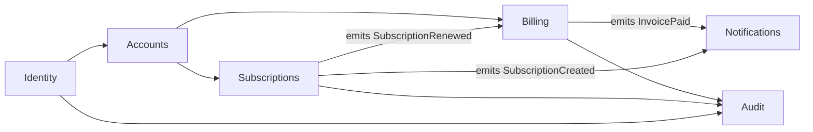

# Component breakdown: drawing the boundaries

This reference is the expansion of SKILL.md Step 3. Given a system shape from Step 2, name the components. Component means different things in different shapes; Section 1 makes that explicit. The six-field component template (bounded context, responsibility, interface, data ownership, dependencies, failure posture) is the artifact the skill produces. The component dependency graph is the output that feeds roadmap-ready.

**Scope owned by this file:** what a component is per shape, DDD bounded contexts as the boundary language, Conway's Law and Team Topologies as the team-shape input, the six-field component template with good and bad examples, anemic services and god services and distributed monolith antipatterns, granularity heuristics, the boundary-drawing workshop, and the handoff to roadmap-ready's component dependency graph. Shape selection lives in [system-shape.md](system-shape.md); data shape per component lives in [data-architecture.md](data-architecture.md); integration semantics between components lives in [integration-architecture.md](integration-architecture.md).

## Section 1. What a component is in each shape

The word "component" means different things depending on the shape from SKILL.md Step 2. Name it explicitly so the downstream handoff (especially to roadmap-ready's dependency graph) is unambiguous.

- **In a single-service monolith.** A component is a bounded context within the single deployable, usually corresponding to a directory, a namespace, or a loose convention. Enforcement is weak (convention and code review); the monolith shape accepts that cost. Example: in a Rails app, `app/orders/`, `app/billing/`, `app/identity/` as top-level directories, with some informal rule against cross-directory calls.

- **In a modular monolith.** A component is a bounded context with an **enforced module boundary**. The boundary is enforced by a fitness function (Packwerk for Ruby, ArchUnit for Java/Kotlin, dependency-cruiser for JS/TS, NetArchTest for .NET; see [system-shape.md](system-shape.md) Section 2.2 and [evolutionary-architecture.md](evolutionary-architecture.md)). A new engineer trying to import from `orders` into `billing` has the build fail in CI. This is the defining discipline of a modular monolith; without it, the shape is a regular monolith with wishful thinking.

- **In a service-oriented or microservices architecture.** A component is a **deployable with its own database**. The unit of deploy is the service; the unit of data ownership is the service's database. Services do not share databases; sharing a database is the distributed monolith antipattern (Section 7). If two components write to the same database, either they are one component (merge them) or the ownership is split (move the table to the correct owner; the other becomes a reader via the owner's interface).

- **In a serverless architecture.** A component is a **function or a function-group**. A function-group is a set of functions that deploy together, share configuration, and own a bounded responsibility (e.g., the "image processing" function-group includes the S3-trigger function, the resize function, and the watermark function, all deploying as one Terraform module). Function-groups give serverless architectures the equivalent of services; ungrouped Lambdas are the serverless equivalent of an anemic service.

- **In an event-driven architecture.** A component is a **producer or a consumer** of events. A component may be both: a service that consumes `OrderPlaced` and emits `PaymentCharged`. The event log or queue is the integration surface; the component's boundary is its subscription topic set plus its emission set.

- **In an edge-native architecture.** A component is an **edge function plus its data binding**. An edge worker that reads from D1 and writes to Durable Objects is a component; the data binding is part of the component's surface, because edge-native data stores have placement semantics (single-writer region, replication topology) that are architectural.

Name this explicitly in ARCH.md's component section. "Our components are modular-monolith bounded contexts enforced by Packwerk in CI" is a decision. "Our components are..." with no qualifier is ambiguous and will produce a dependency graph whose edges mean different things in different rows.

## Section 2. Domain-Driven Design as the boundary language

The component boundary is not a technical decision; it is a domain decision that the technical structure must follow. Eric Evans, "Domain-Driven Design: Tackling Complexity in the Heart of Software" (Addison-Wesley, 2003; RESEARCH-2026-04.md section 3.13), is the canonical reference. Vaughn Vernon's "Implementing Domain-Driven Design" (Addison-Wesley, 2013) is the practical companion.

### 2.1 The bounded context

A bounded context is a subsystem of the domain where a single, consistent model applies. The word "Order" means one thing in the ordering context (a cart plus line items plus state transitions from placed through fulfilled) and something different in the billing context (a set of charges, refunds, adjustments against an invoice). The same word, two models; the two models are not the same model, and conflating them is the source of most monolith-as-big-ball-of-mud failures.

**The bounded context is the unit of component decomposition.** In the seven shapes from [system-shape.md](system-shape.md):

- Modular monolith: one module per bounded context.
- Service-oriented: one service per bounded context, with service granularity matching bounded-context granularity.
- Microservices: services can be smaller than a bounded context (one bounded context, multiple services collaborating), but never smaller than a domain-meaningful operation. Services smaller than a domain-meaningful operation become anemic (Section 5).

### 2.2 Ubiquitous language

Within a bounded context, the domain language is "ubiquitous": the code, the tests, the PRD, the stand-up, the product manager's email, and the customer support ticket use the same terms. "Order" in ordering means the same thing to the product manager, the engineer, the support rep, and the database column. Across bounded contexts, the language legitimately diverges (billing's "Order" is not ordering's "Order").

The architecture document should name the ubiquitous language per bounded context. A one-line glossary per component ("Order = a cart in a state of Placed, Paid, Fulfilled, Cancelled, or Returned, owned by the ordering context") prevents the cross-context confusion that produces anemic or overlapping components.

### 2.3 Context map

A context map is the set of relationships between bounded contexts. Evans names several:

- **Partnership.** Two contexts coordinate closely; changes in one require coordination with the other.
- **Customer-supplier.** One context (supplier) serves another (customer); the customer's needs drive the supplier's interface.
- **Conformist.** A downstream context accepts the upstream's model as-is (often the case for integration with a third-party API).
- **Anticorruption layer.** A translation layer between contexts so the downstream model is not polluted by the upstream model.
- **Open host service.** A context publishes a stable public interface for many consumers.
- **Published language.** The shared language (often an event schema) that multiple contexts use to communicate.
- **Shared kernel.** A small shared model between two contexts (use sparingly; shared kernels are a coupling hazard).
- **Separate ways.** Two contexts that genuinely do not need to integrate.

The context map is not required in ARCH.md explicitly, but the **integration architecture section** (SKILL.md Step 5) is effectively a context map expressed in sync/async, protocol, and failure-semantics terms. The relationship names are useful vocabulary when reasoning about how components talk.

### 2.4 Not every project needs full DDD

DDD's full apparatus (aggregates, value objects, entities, domain events, repositories, factories, application services, domain services, bounded-context-aware CQRS) is heavy. Applying it to a CRUD app with ten entities is over-engineering (the Clean Architecture critique; RESEARCH-2026-04.md section 4.8). The load-bearing concept is the **bounded context** itself. A team that uses "bounded context" to name its modules, checks its ubiquitous language, and draws its context map has most of what DDD offers the architecture tier. Aggregates, repositories, and the full tactical-DDD pattern catalog are implementation concerns that production-ready can address if they apply.

The test: if the PRD names 5-15 entities with clear domain relationships and the team can articulate "ordering is not the same as billing even though they both have an Order concept," the bounded-context discipline applies and is worth the minimal investment. If the PRD is a single entity with trivial relationships, bounded contexts are not load-bearing and the architecture should say so.

## Section 3. Conway's Law and Team Topologies

**Conway's Law** (Melvin Conway, "How Do Committees Invent?", Datamation 1968): organizations that design systems are constrained to produce designs which are copies of the communication structures of those organizations. The empirical observation that software architecture mirrors team structure, tested and re-tested across six decades. Architecture decisions are team decisions; team decisions are architecture decisions.

**Team Topologies** (Matthew Skelton and Manuel Pais, IT Revolution, 2019; RESEARCH-2026-04.md section 3.8) is the modern codification. Four team types:

- **Stream-aligned team.** Owns a product area end-to-end (a bounded context, a customer-facing capability). The default team type. Most teams in most organizations should be stream-aligned.
- **Enabling team.** Helps stream-aligned teams acquire missing capabilities. Short-lived, consulting-shaped. Example: a testing-practices enabling team that embeds with stream-aligned teams for 6 weeks to level up their testing discipline.
- **Complicated-subsystem team.** Owns a subsystem whose complexity demands specialist expertise (a real-time audio processing pipeline, a cryptographic key management layer, a physics engine). Rare.
- **Platform team.** Builds a platform that stream-aligned teams consume as a service (internal developer platform, CI/CD infrastructure, shared observability).

Three interaction modes:

- **Collaboration.** Two teams work closely together, often on a shared problem. High-bandwidth, expensive.
- **X-as-a-service.** One team consumes another's output without deep collaboration (the platform team exposes a self-service interface).
- **Facilitation.** An enabling team helps another team, often short-term.

### 3.1 Cognitive load as the constraint

Team Topologies' central empirical claim: a team can own about as much as fits its cognitive load budget. The budget is roughly the domain complexity of the bounded contexts the team owns, plus the operational complexity of the systems they run, plus the incident surface they respond to.

The Dunbar-adjacent informal limits: a single stream-aligned team is usually 5-9 people. Teams larger than that fragment their cognitive load across subgroups and require coordination overhead that the team structure cannot absorb. Teams smaller than 3 cannot run an on-call rotation without burnout.

Multiple stream-aligned teams coordinate through the platform team, enabling teams, or published-language interfaces between bounded contexts. The architecture's component count should roughly match the stream-aligned team count: if there are 5 stream-aligned teams, there should be roughly 5 bounded contexts, each owned by one team. If the architecture has 25 microservices and 5 teams, some teams own 5 services each, and the coordination tax is high.

### 3.2 The inverse Conway maneuver

Restructuring the team to produce the architecture you want. If the PRD's ideal architecture has a clear separation between ordering, billing, and identity, and the current team is a single undifferentiated pool, a team restructure (create three stream-aligned teams, one per bounded context, each with its own on-call) precedes or accompanies the architectural split. Without the team restructure, Conway's Law wins and the architectural split reverts within six months.

### 3.3 Team shape drives component shape

Specifically:

- **One stream-aligned team, 5-9 people, one bounded context.** Default to a single-service monolith or one module in a modular monolith. No service-level split.
- **Two to four stream-aligned teams, each owning a bounded context.** Modular monolith with enforced boundaries, OR service-oriented with 2-4 services. Pick monolith unless a forcing function (system-shape.md Section 4) is present.
- **Five-plus stream-aligned teams.** Service-oriented is usually right; microservices if the other forcing functions are also present.
- **Platform team exists.** A platform component (internal developer platform, shared infrastructure, internal API gateway) may appear in the architecture. It is a complicated-subsystem or platform component; name it explicitly.
- **Complicated-subsystem team exists.** The subsystem they own is a specific architectural component with a specialist interface to the rest of the system.

The component breakdown should therefore name, for each component, the team (or team type) that owns it. If the PRD's team section says "4 engineers, no planned split," the architecture should not have 12 components; it should have one or two.

## Section 4. The six-field component template

Every component in ARCH.md has six fields. SKILL.md Step 3 defines them; this section walks through each with good and bad examples. Filling fewer than six fields produces ambiguity; the downstream skills (roadmap-ready, stack-ready, production-ready) each depend on specific fields.

### 4.1 Bounded context

The domain name. From the PRD's entity list and the ubiquitous language. The bad defaults: generic names (`UserService`, `CoreAPI`, `BackendService`, `Services`), layer names (`DataLayer`, `BusinessLogic`, `API`), framework names (`RailsApp`, `NextJSApp`), deployment names (`AWSLambda1`, `Worker`, `CronJob`).

**Good examples.** `Ordering`, `Billing`, `Identity`, `Inventory`, `Catalog`, `Fulfillment`, `Notifications`, `Payouts`, `Checkout`, `Search`, `Recommendations`, `Support`, `Reporting`. Each names a domain area a product manager, an engineer, and a customer-support rep would recognize.

**Bad examples.** `UserService` (user is an entity across many contexts; which one?). `CoreAPI` (core of what?). `BackendService` (what does it do?). `DataLayer` (layer, not context). `NotificationMicroservice` (the implementation is not the boundary). `AdminPanel` (a UI, not a bounded context; the admin panel likely spans multiple bounded contexts).

### 4.2 Responsibility

One sentence. "Owns the order lifecycle from cart through fulfillment, including pricing at time of order and state transitions." The sentence answers: what does this component do, why does it exist, and what would be different if it did not exist.

**Good examples.**
- "Owns the order lifecycle: cart creation, line-item mutation, pricing at order-placement time, state transitions (Placed / Paid / Fulfilled / Cancelled / Returned), and the canonical order record for downstream consumers."
- "Owns tenant identity: account provisioning, user authentication, session issuance, session rotation, password and MFA lifecycle, and the trust boundary between unauthenticated and authenticated callers."
- "Owns inventory reservation across a distributed warehouse network: availability queries, reservation creation, reservation expiry, and eventual release back to the available pool."

Each sentence compresses what the component does and why. A reader can place a new feature (Who owns the refund flow? Billing, because billing owns charges and refunds; or ordering, because the return state triggers the refund?) against these sentences and decide.

**Bad examples.**
- "Handles orders." (Too vague. Handles how? What is the scope?)
- "Manages users." (Too vague. What aspect of users?)
- "Handles orders AND pricing AND inventory." (Compound responsibility. Three bounded contexts in one box. Split.)
- "Does the business logic." (Empty. Every component does business logic; this says nothing.)
- "The ordering microservice." (Names the implementation, not the responsibility.)

The compound-responsibility test: if the sentence contains "and" or "plus" joining separable responsibilities, split the component or articulate why the conjunction is tight (e.g., "line items AND pricing at order-placement time" is tight because price is a property of the line item at the moment of ordering, not a separable concern).

### 4.3 Interface

The shape of communication in and out. Specify sync or async, the wire format, the authentication shape, and the idempotency posture for mutations.

**Good examples.**
- "REST over JSON at `/api/v1/orders`, authenticated with tenant-scoped API keys. POST is idempotent via `Idempotency-Key` header with a 24-hour dedup window. Internal consumers call the same endpoint with a service-to-service JWT."
- "Consumes `OrderPlaced` events from the Kafka topic `orders.placed.v1` (at-least-once delivery, idempotent consumer keyed on `order_id`). Emits `PaymentCharged` events to `payments.charged.v1` after successful charge."
- "gRPC over HTTP/2 on `inventory.v1.InventoryService`, mutual TLS between services within the mesh. Unary calls only; no streaming. All mutations are idempotent via `ReservationId` as the idempotency key."
- "No public interface; triggered by S3 `ObjectCreated:*` events on the `user-uploads` bucket. Writes results to DynamoDB `image-metadata` table. Retried by AWS Lambda retry policy (2 retries, exponential backoff) with a dead-letter queue on final failure."

**Bad examples.**
- "REST API." (Over what? Authenticated how? Idempotent? Versioned?)
- "Calls to the service." (What kind of call? Sync, async? Protocol?)
- "Receives events." (From what? Guaranteed delivery? Ordering?)
- "Web endpoints." (Too generic.)

The interface field is what production-ready will implement, what stack-ready's choice of broker/gateway depends on, and what observe-ready will instrument. Ambiguity here propagates downstream.

### 4.4 Data ownership

Which entities the component writes. The canonical rule: **one writer per entity, many readers.** If two components write to the same entity, either they are one component (merge) or the data ownership is split (move the write to the correct owner; the other becomes a reader via the owner's interface).

**Good examples.**
- "Writes: `orders`, `order_line_items`, `order_state_transitions`. Reads: `products` (from Catalog, via Catalog's REST API). Does not write to `products`, `users`, or `payments`."
- "Writes: `users`, `sessions`, `password_resets`, `mfa_factors`. Reads: nothing from other bounded contexts. Exposed via the Identity REST API for all other components."
- "Writes: `inventory_reservations`, `inventory_reservation_expirations`. Reads: `products.sku` (via Catalog's published event stream, materialized locally). Does not write product data even though it reads it."

**Bad examples.**
- "Uses the database." (Which tables? Writes or reads?)
- "Owns data." (What data?)
- "Writes to the shared `users` table." (If "shared" means "multiple components write to it," this is the distributed monolith antipattern. Section 7.)

The data ownership field is load-bearing for the distributed-monolith check (Section 7), for the data architecture section (SKILL.md Step 4), and for the tenant-isolation check (SKILL.md Step 7). It is the single most useful field for catching bad decompositions early.

### 4.5 Dependencies

Other components this component depends on. The set of edges from this node in the component dependency graph. Each dependency is a sync call, an async subscription, or a data read.

**Good examples.**
- "Depends on: Identity (sync REST, for user-session validation); Catalog (sync REST, for product lookup at cart-line add); Inventory (sync REST, for availability check at checkout); Payments (sync REST, for charge at order confirmation). Emits events consumed by: Fulfillment, Notifications, Reporting (all async, via `orders.*` Kafka topics)."
- "Depends on: no other components (it is a leaf). Consumed by: Ordering, Checkout, Support."

**Bad examples.**
- "Depends on the database." (The database is not a component; which component owns the data?)
- "Depends on everything." (Then the architecture has failed.)

The dependencies field is the adjacency list that roadmap-ready consumes as the component dependency graph. A mistake here propagates into sequencing.

### 4.6 Failure posture

What happens if this component fails. Who is affected, for how long, and what is the degradation plan.

**Good examples.**
- "Critical path. If Ordering is down, cart add, checkout, and order placement all fail. Degradation: front-end shows a cached cart (read-only) and a 'try again in 5 minutes' message on checkout. Blast radius: revenue stops for the duration. Recovery SLO: 15 minutes."
- "Eventually consistent. If Inventory sync is delayed, `availability` on the product page shows up to 60 seconds stale. Degradation: falls back to last-known-good counts; flags stale counts on the admin dashboard. Blast radius: oversell risk proportional to stale window. Recovery: resumes on next sync."
- "Best-effort. If Notifications is down, email and SMS are queued in the outbox and retried for up to 24 hours. Degradation: no user-visible effect until the 24-hour window expires. Blast radius: delayed notifications; no data loss."
- "Fail-closed. If Identity is down, all authenticated endpoints return 503. Public endpoints (marketing pages, signup) remain available. Degradation: no user-visible session continuity; users must re-authenticate after recovery. Blast radius: every authenticated user during the outage window. Recovery SLO: 5 minutes."

**Bad examples.**
- "Should be highly available." (Should how? Number?)
- "Handles failures gracefully." (How? What is graceful?)
- (Empty field.) (The cascading-failure surprise is guaranteed.)

Every component has a failure posture. Silence in this field is the "cascading failure surprise" antipattern: the team does not know what happens when the component fails, and finds out during the incident.

## Section 5. The anemic services antipattern

Martin Fowler, "Anemic Domain Model" (2003, https://martinfowler.com/bliki/AnemicDomainModel.html), describes the code-level pattern: domain objects with data but no behavior, with behavior externalized to service classes. At the architecture tier, the analogous pattern is the **anemic service**: a service that is a thin wrapper over a database table, with CRUD endpoints and no domain logic.

### 5.1 Symptoms

The canonical anemic service names:

- `UserService` (thin wrapper over the `users` table with CRUD endpoints).
- `AuthService` (often a thin wrapper over `users` plus `sessions` plus `tokens`, with no domain cohesion beyond "authentication things").
- `NotificationService` (thin wrapper over `notifications` table, sending emails based on rows).
- `OrderService` (when the `orders` table is the only content; no lifecycle, no state transitions, no pricing logic).
- `PaymentService` (thin wrapper over Stripe's API with no reconciliation, no idempotency discipline, no ledger).

The symptom: a reader looking at the service cannot articulate the domain responsibility beyond "it handles X entity." The service is CRUD clothing on a table, not a bounded context.

### 5.2 Why it is wrong

**The service is a network hop for no benefit.** Every call into `UserService` is a network round-trip that would have been an in-process function call in the calling component. The latency tax, the operational tax (one more service to deploy, monitor, alert on), and the distributed-failure-mode tax are all paid without a compensating benefit.

**The boundary is in the wrong place.** The reason bounded contexts exist is that the same entity (User) has different semantics in different contexts (a User in Identity is an authentication principal; a User in Billing is the holder of a payment method; a User in Ordering is the entity the order is shipped to). Decomposing by entity produces a service whose job is "everything about the User entity," which is the union of all the bounded-context semantics. The resulting service tries to be everything to everyone and becomes a god service (Section 6) or stays anemic and pushes the real logic into its callers (which then become anemic or coupled or both).

**It does not even reduce coupling.** The calling components now couple to the anemic service's API AND to the semantics the anemic service cannot capture (they have to know how to use the Users-the-anemic-way for their specific domain).

### 5.3 How to fix

Consolidate the anemic service into the bounded context that actually owns the behavior. If `UserService` is being called primarily by Identity for authentication things, merge it into Identity. The `users` table lives with Identity; Billing reads user profile data via Identity's Identity API, not by calling `UserService`. The Identity API exposes what Billing needs (user profile lookup by ID), and that is a real bounded-context interface.

The heuristic: if a service's public interface is a 1:1 map of CRUD operations on a single table, it is anemic. Move the table and the operations into the component that owns the behavior.

**Exception.** A genuinely cross-cutting service (an authentication service that is the single trust boundary for a multi-service system) can be thin AND correct, because its responsibility is the trust boundary itself, not the entity it happens to manage. The test: does the service have domain behavior beyond CRUD? If the answer is "it issues and validates sessions and enforces the authentication trust boundary and tracks MFA state and password reset tokens," then the responsibility is trust-boundary-enforcement, not user-CRUD; the service is not anemic.

## Section 6. The god services antipattern

The opposite of anemic: a service that owns half the domain. `OrderService` that owns orders AND pricing AND inventory AND fulfillment AND notifications. `CoreService` that owns everything the team has not otherwise figured out where to put. `MonolithicAPI` that is the inside of a monolith with a REST API painted on top.

### 6.1 Symptoms

- A service whose responsibility sentence is a compound (SKILL.md Step 3 explicit red flag).
- A service that owns multiple entities with different lifecycles and different ownership semantics.
- A service that multiple teams contribute to and none owns.
- A service whose name is generic (`CoreAPI`, `BackendService`, `MonolithicAPI`, `MainService`).
- A service whose codebase exceeds the cognitive load of the owning team (the team cannot hold the whole thing in their head; Team Topologies Section 3).
- A service whose deployment is coordinated across many teams (the single-pipeline-contention symptom; [system-shape.md](system-shape.md) Section 7.3).

### 6.2 Why it is wrong

**The god service is a monolith wearing service clothing.** It has all of the monolith's coordination costs (everyone contributes, everyone's deploy is everyone else's blast radius) without any of the monolith's benefits (in-process calls, transactional consistency). It is the worst of both worlds.

**The bounded contexts are hidden.** A god service usually has 3-5 bounded contexts inside it. They are discoverable by asking "what would split from this cleanly?" The fact that they are hidden rather than explicit means the team has not done the boundary-drawing work (Section 9).

**Deployment coordination dominates.** Every change to the god service requires consensus across the teams that contribute. Deploy cadence drops. Feature throughput drops.

### 6.3 How to fix

Split by bounded context, not by "big thing" vs. "small thing." The wrong split: take the god service and pull out a NotificationsService because notifications seemed easy. The right split: identify the bounded contexts inside the god service (Ordering, Billing, Identity, Inventory, ...), draw the boundary lines, extract one bounded context at a time using the Strangler Fig pattern ([system-shape.md](system-shape.md) Section 8.1), and enforce the new boundaries with fitness functions.

The heuristic: if a service's responsibility cannot be expressed in one sentence without compounds, it is a god service. Split it along the natural domain seams.

## Section 7. The distributed monolith antipattern

Sam Newman's canonical definition (RESEARCH-2026-04.md section 2.6, "Monolith to Microservices" 2019 and InfoQ 2016): the services are separately deployable but have so many dependencies that they must be deployed together. Multiple services writing to the same table. Synchronous call chains across every user request. Shared schema. Deploys that span multiple services because a contract change requires coordinated rollout.

### 7.1 Symptoms

Three canonical smells; any one is sufficient to diagnose.

**(1) Multiple services writing to the same table.** The most reliable signal. If `OrderService` and `BillingService` both have `INSERT INTO charges` in their code paths, the ownership is undefined; a schema change to `charges` requires coordination across both services; the transactional consistency across the two writes is broken; and the blast radius of a deploy bug spans both services.

**(2) Synchronous call chains across every user request.** If a single user action triggers a synchronous chain `A -> B -> C -> D -> E -> database`, the services are coupled at the latency layer (E's p99 becomes A's p99, not additively but multiplicatively across the chain), at the availability layer (E's 99.5% becomes A's 97.5% over five hops), and at the error-handling layer (any failure anywhere cascades). The services are separately deployable on paper; they are jointly deployable in practice because a change to any one ripples through the chain.

**(3) Shared schema.** Two or more services share a database schema. Even if they claim separate "tables" within the schema, a schema change requires coordinated migration across all sharing services. The deploy blast radius is the union of all the services.

Sub-symptoms:
- Services that must deploy together to stay in sync.
- Contract changes that require coordinated rollout across teams.
- Integration tests that require spinning up N services.
- A single feature that touches M services.
- Local development that requires running the full service graph.

### 7.2 Why it is wrong

**It has all of the microservices costs and none of the benefits.** The coordination tax, the distributed-systems debug tax, the version-skew tax, the observability tax: all paid. The independent deploy cadence, the independent scale curves, the independent failure isolation: none received.

**It is a failed extraction.** The distributed monolith is almost always the result of extracting services from a monolith without first identifying the bounded contexts, without first enforcing module boundaries, and without first drawing the data ownership lines. The extraction happened before the boundaries were ready.

### 7.3 How to detect

**The table-sharing query.** List every database table. For each, list the services that issue `INSERT`, `UPDATE`, or `DELETE` against it. If any table has more than one writer, the architecture has a distributed-monolith smell.

**The synchronous call graph.** Trace a representative user request through the service graph. Count the synchronous hops. If the number is greater than 3 for a single user action and the hops are all synchronous, the latency and availability math (SKILL.md Step 6) is almost certainly broken.

**The contract-change blast radius.** When was the last cross-service contract change? How many services had to deploy together to ship it? If the answer is more than one, deploy coordination is real.

### 7.4 How to refactor

Two directions, either is acceptable depending on the specifics:

**(a) Merge the services back.** If the services cannot deploy independently, they are one component. Merge them into a modular-monolith module, enforce the boundary with a fitness function, and defer the service extraction until the boundary is clear. This is the consolidation pattern ([system-shape.md](system-shape.md) Section 8.2).

**(b) Split the data.** If the services genuinely need to deploy independently, move the shared tables to a single owner. The other services become readers via the owner's interface (not via direct DB access). This is the "one writer per entity" rule (Section 4.4) enforced as a refactor.

The choice between (a) and (b) depends on whether the team is ready to pay the microservices coordination tax. If the forcing functions ([system-shape.md](system-shape.md) Section 4) are not present, (a) is usually right. If they are, (b) is the work.

## Section 8. Granularity: the right number of components

The wrong question: "how many components should we have?" There is no answer. Shopify has hundreds of internal modules. Amazon has thousands of microservices. A single-founder SaaS has one. The question that produces an answer is: **does this proposed split or merger serve a specific constraint in the PRD?**

### 8.1 Heuristics that produce a split

- **Team-ownership split.** A new stream-aligned team is forming; a bounded context can be cleanly extracted and handed to them. Split.
- **Scale-curve split.** One bounded context has a 10x traffic curve relative to the rest, and the cost of scaling the whole system to match is higher than the cost of splitting. Split.
- **Compliance split.** A subset of the system is in PCI or HIPAA scope; physical separation reduces audit scope. Split.
- **Failure-isolation split.** The availability requirement for one bounded context is an order of magnitude stricter than the rest. Split.
- **Deployment-cadence split.** One bounded context ships ten times a day; another ships once a quarter. The cadence mismatch creates deployment-contention on the shared pipeline. Split.

Each of these cites a PRD constraint (team size, traffic numbers, compliance regime, availability target, deploy cadence). A split without a citable constraint is speculation.

### 8.2 Heuristics that produce a merger

- **The anemic-service smell.** A service is a thin wrapper over a table with no domain logic. Merge into the owning bounded context (Section 5).
- **The distributed-monolith smell.** Services share a database or deploy together. Merge (Section 7).
- **The team-size mismatch.** There are more services than there are stream-aligned teams; some teams own 3-5 services each. Merge until service count matches team count plus a small overhead for cross-cutting infrastructure.
- **The coordination-cost smell.** Every feature touches M services; contract changes require coordinated deploys. Merge until the feature-to-service ratio is closer to 1:1.

### 8.3 The "right" number for a given PRD

**Solo founder, pre-PMF, weeks of appetite.** One component. The architecture is a single-service monolith; the component breakdown has one row. The PRD's entities are the internal module structure, not the service structure. This is the correct shape; resist the urge to produce five components for "future-proofing."

**Team of 2-5, early B2B SaaS.** One to three components. A Rails/Django/Phoenix monolith with module boundaries; Identity as a module, Billing as a module, the product domain as a module. No external service boundaries yet.

**Team of 10-30, growing B2B SaaS.** 3-7 components. Modular monolith with enforced boundaries (Packwerk et al.), or early service-oriented decomposition if the forcing functions are present.

**Team of 50+, mature product.** Dozens of components, aligned with stream-aligned team count. Microservices may be the right shape if all three forcing functions are present.

The number is an outcome of the team-shape and PRD-constraint analysis, not an input to it. An architecture that says "we will have 12 components" without first naming the teams and the constraints that require 12 is working backward.

## Section 9. The boundary-drawing workshop

How to actually draw the boundaries, in practice, from a PRD. This is the skill-within-the-skill; most bad decompositions come from skipping this step.

### 9.1 Step 1: list the entities

From the PRD (prd-ready handoff block, entities list). Example for a B2B SaaS invoicing product:

```
User, Account, Organization, Invoice, LineItem, Payment, Subscription, Plan,
Customer, PaymentMethod, TaxRate, Refund, Credit, Discount, Session, APIKey,
Webhook, AuditLog.
```

Write them all down. Do not pre-decompose.

### 9.2 Step 2: group by ubiquitous language

Look for entity groups whose language clusters. In the invoicing example:

- **Identity cluster:** User, Session, APIKey. (Authentication and access, the trust boundary.)
- **Account cluster:** Account, Organization. (Tenancy, ownership, provisioning.) Sometimes merged with Identity depending on whether organizations have their own lifecycle distinct from users.
- **Billing cluster:** Invoice, LineItem, Payment, Refund, Credit, TaxRate, Discount. (Money-in, money-out, ledger.)
- **Subscriptions cluster:** Subscription, Plan, Customer, PaymentMethod. (Recurring revenue, customer state.) The boundary between subscriptions and billing is often fuzzy.
- **Webhooks cluster:** Webhook. (External integration surface.)
- **Audit cluster:** AuditLog. (Cross-cutting.)

The clustering is the first draft of the bounded contexts.

### 9.3 Step 3: list the commands and queries

For each entity, what commands (state-changing operations) and queries (read operations) does the PRD describe? Example for Invoice:

- Commands: createDraft, addLineItem, finalize, sendToCustomer, markPaid, markUnpaid, voidInvoice, applyCredit, applyDiscount.
- Queries: getInvoice, listInvoicesForAccount, listInvoicesForCustomer, listOverdueInvoices, exportInvoicesForAccounting.

Do this for every entity or entity cluster.

### 9.4 Step 4: find the seams where commands diverge

Look at which commands cluster together and which diverge. `markPaid` on an Invoice triggers a payment reconciliation; the payment reconciliation belongs in Billing. `sendToCustomer` on an Invoice triggers a notification; the notification belongs in the Notifications context (or in a cross-cutting Notifications module). `finalize` on an Invoice triggers a state transition in the Subscriptions context if the invoice is a subscription renewal.

The commands that coordinate across clusters are the integration points; the commands that stay within a cluster are internal to a bounded context.

### 9.5 Step 5: draw the boundary

Formally:
- Bounded context = entity cluster + the commands that stay within the cluster.
- Interface between bounded contexts = the commands that cross the boundary, surfaced as sync APIs, async events, or data reads.

For the invoicing example:
- **Identity:** User, Session, APIKey; commands: authenticate, issueSession, rotateAPIKey, etc.
- **Accounts:** Account, Organization; commands: provisionAccount, upgradeOrganization, inviteUser, etc.
- **Billing:** Invoice, LineItem, Payment, Refund, Credit, TaxRate, Discount; commands as listed.
- **Subscriptions:** Subscription, Plan, Customer, PaymentMethod; commands: createSubscription, changeBilling, cancelSubscription, renewSubscription (which emits an Invoice-creation command into Billing).
- **Notifications:** cross-cutting; triggered by events from Billing and Subscriptions.
- **Audit:** cross-cutting; subscribes to events from all other contexts.

### 9.6 Step 6: name it, ensure the language is domain-meaningful

Each context gets a name a domain expert would recognize. Avoid generic names (`CoreService`, `MainAPI`, `UtilityService`). The name is the ubiquitous-language anchor for the context.

### 9.7 Step 7: verify against the failure modes

Run the three checks:

- **Anemic check (Section 5).** Is any context just CRUD over one table? If so, merge it into the owning context.
- **God check (Section 6).** Does any context have a compound responsibility? If so, split it.
- **Distributed-monolith check (Section 7).** Do two contexts write to the same entity? If so, move the ownership or merge them.

The surviving boundaries are the component breakdown.

## Section 10. Feeds the component dependency graph

The component breakdown's dependencies field (Section 4.5) is the adjacency list that becomes the component dependency graph. Roadmap-ready consumes this graph to sequence the work.

### 10.1 The graph

Each component is a node. Each dependency (from the Section 4.5 field) is a directed edge: A depends on B means an edge from A to B. Edge labels are sync or async (the integration shape; see [integration-architecture.md](integration-architecture.md)).

Output format options, any of which roadmap-ready can consume:
- **Mermaid flowchart** in ARCH.md (text-based, version-controllable, renders in GitHub).
- **DOT / Graphviz** format for tools that want to compute critical paths.
- **Markdown adjacency list** (human-readable, machine-parseable).

Example Mermaid fragment:



### 10.2 What roadmap-ready does with it

Roadmap-ready (downstream, per the architecture-ready handoff block) takes the graph and computes:

- **Critical path.** The longest dependency chain, in topological order. The first-ship-date estimate depends on this.
- **Parallelism surface.** Components with no mutual dependency can be built in parallel; identifying these reveals where adding engineers helps and where it does not.
- **Build-order constraints.** "Auth must be built before any tenant-scoped component." "Audit log must exist before any regulated-domain CRUD." "Event bus must be deployable before any async-consuming service." These are expressed as pre-conditions on components in the graph.
- **Cycles.** Cycles in the graph are architectural defects. Break them (introduce an event bus, invert a dependency, extract a shared interface) before roadmap-ready runs.

### 10.3 The architecture-ready contribution to the graph

Architecture-ready is responsible for producing the graph in a shape roadmap-ready can consume. Specifically:

- **Every component has zero or more outgoing edges** (its dependencies) and zero or more incoming edges (its consumers).
- **Every edge has a type** (sync call, async subscription, data read).
- **Every cycle is flagged** or broken before handoff.
- **The build-order constraints** are named explicitly (as text, alongside the graph) so roadmap-ready does not have to infer them.

The graph is a first-class artifact of ARCH.md. A component breakdown that produces a list of components without the dependency graph has not finished the job; roadmap-ready has to guess the edges, and the guesses will be wrong.

---

The component breakdown is the bridge from shape (Step 2) to everything downstream. Name each component with the six fields. Apply the three antipattern checks (anemic, god, distributed monolith). Run the boundary-drawing workshop (Section 9) when the PRD is ambiguous. Produce the graph. The shape has the scale ceiling; the breakdown has the team-fit; the graph has the sequencing.
